raw den ― ありのまま書けばいい。じぶんのねぐらなんだから。 

2026-06-04 現在建設中です。UNDER CONSTRUCTION.

# 序文
ねぐら（塒）とは、鳥類が夜間に休息や睡眠をとる場所のことです。転じて、人間にとっての自分の家――特に隠れ家や秘密基地のニュアンスを指します。

鳥類はしばしば子育てのための「巣」と、夜を過ごすための「ねぐら」を分けます。同様に、人間も、ありのままの自分で過ごせる場所が必要なのでしょう。レイ・オルデンバーグがいう「サードプレイス」も近いですが、私は少し異なると考えます。

ねぐらは聖域です。自分以外の、一切の侵入を許さない、自分のためだけの空間と言えます。なぜなら他者の存在を気にしないことで、はじめて、ありのまま（生のまま）過ごせるようになるからです。

サードプレイスとは違います。サードプレイスは気分転換にすぎない。カフェや書店等が挙げられますが、本質的に他者も存在している。そうではなく、私たちは時として解放されたいのです。そのためには、ありのまま過ごせる場所が必要ですが、物理的な場所の確保は難しいし、確保しても通い続けるのが難しい。だからこそ、デジタルな場に目を向けることになります。

私は 20 年以上、「じぶんのねぐら」を追求してきました。まがいなりにも、この現代において正気を保てているのも、ねぐらのおかげです。一方で、正気を保てず苦しむ人も多いように見受けられる。「じぶんのねぐら」をもっと広めてみたいと考えました。

私が考える「じぶんのねぐら」と、そのつくりかたを紹介したい。rawden と名付けました。raw（生のまま） + den（ねぐら）から来ています。読み方は **ローデン** です。

自分の、自分による、自分のためのねぐらを。ローデンを、一緒につくっていきましょう。

# ねぐらとは、どのようなもの？

## ねぐらとは Cosense を使った箱庭
このようなものです。

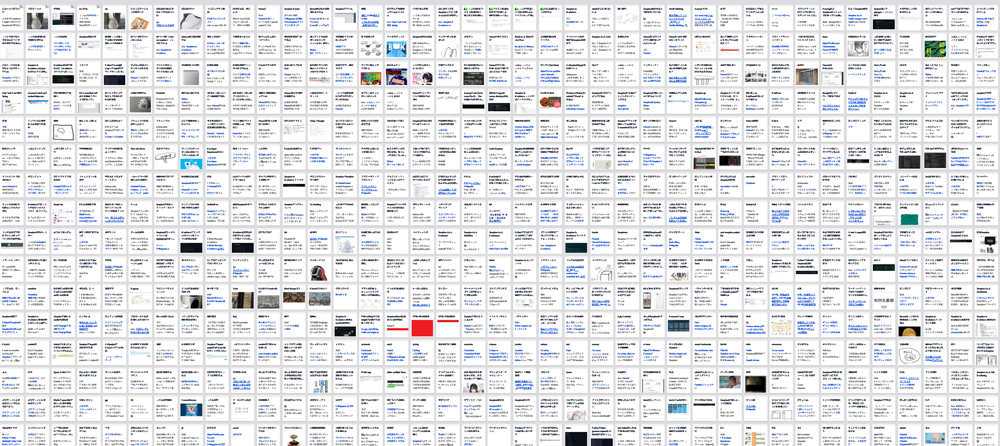

※ボリュームを示すため＆プライベートな内容を伏せるために圧縮表示しています。本当はもっと見やすいです

一言で言えば **Cosense（旧Scrapbox）を使ったプライベートプロジェクト** を使います。Cosense はウィキと呼ばれるもので、プロジェクトという箱の中に、好きなだけページをつくれます。ねぐらですので、他の人には見せず、したがってパブリック（公開）ではなくプライベート（自分のみ）としてつくります。

また、ねぐらは（箱は）一つとは限りません。一つにすれば何でも詰めれて楽ですが、ごちゃごちゃします。複数に分けると、箱ごとの使い分けを明確にできますが、どの箱に入れようか？どの箱を見ようか？といった迷いが生じやすくなります。

どちらでもいいですし、迷っていいんです。ねぐらは、長い時間をかけて営んでいくものと思います。箱をいくつ抱えるか、という点も含めて楽しんでいきましょう。

## ねぐらには何でも詰め込める
何を詰め込むかはあなた次第です。便利にもできますし、楽しくもできます。

例として、私の主な用途を 5 点ほど挙げます。

### (1/5) 日記を書く
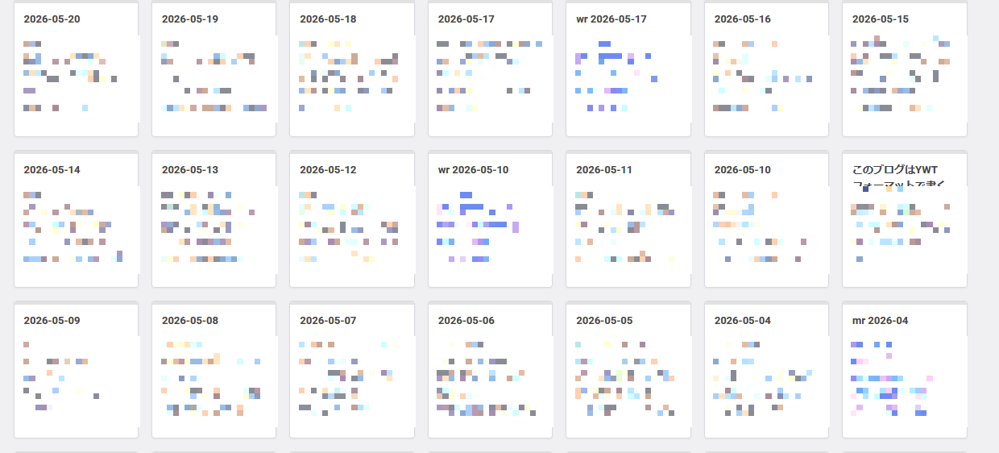

地味ですが、便利で楽しい使い方です。

たとえば次のようにします:

- 2026-06-08 のように日単位でページをつくって日記を書きます
- 1 週間ごとに、7 日分のページを束ねたリンク集をつくって、週記にします
- 1 ヶ月ごとに、4～5 週間分のページ（週記が 4～5 ページあるはず）を束ねたリンク集をつくって、月記にします

こうすれば日記を書きつつも、週単位・月単位で読み返せます。振り返りをしてもいいですね。

私は真面目な使い方をしていて、日記として「何をやったか」「どう思ったか」を記録しています。フリーフォーマットで、X のようにつぶやく感じ。そして週ごとに束ねて振り返り、さらに月ごとに束ねて振り返っています。そうすることで人生に規律を与えています。

他には、単に日単位で写真メインの日記を何年も書いている人もいますし、日単位だとだるいので週単位からスタートして 7 日分の日記を書く人もいます。

### (2/5) オリジナルキャラクターをつくって動かす
ローデンはじぶんのねぐら、じぶんだけのねぐらですので、思いつきから妄想まで何でも込められます。

以下は私が [Waifu Labs - Magical Anime Portraits](https://waifulabs.com/) でつくった、いわゆる「俺の嫁」です:

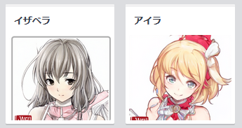

Cosense でページに画像を貼ると、アイコンとして挿入できるようになります。これを使うと、本文中でその自分が語っているかのような書き方ができます。

以下を見てください。下品なボケ方に対して、アイラからツッコミが入っています:

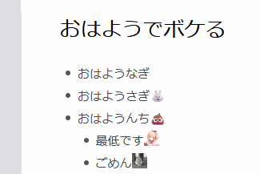

そして私が「ごめん」と謝っていますね。**これらは自作自演であり、ひとり芝居を書いてやっているようなもの** ですが、いいんです。じぶんのねぐらだもの。

もちろん楽しみ方もこれだけではないです。私は自分を主人公にして、良い思いをさせるようにつくるのが好きですが、自分は排除してキャラ同士の掛け合いが見たい人であれば、掛け合いを書けば良い。絵にしても、私のようにWebサービスでつくらせて済ます人もいれば、自分で描いたっていい。

### (3/5) 人のページをつくってあれこれする
人はゴシップが好きですし、あれこれ言いたくもなりますが、社会人として堂々と行うわけにもいきません。ローデンならできます。

たとえば佐藤明（例です）さんについて書きたいなら、佐藤明ページをつくって、イラストや写真があればそれも貼り付けて、その上であれこれ書けます:

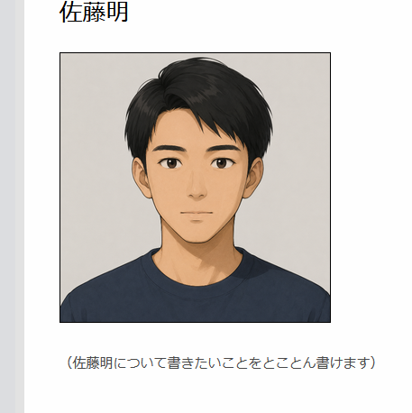

じぶんのねぐらなので何を書いてもいいです。

- ファンの立場で推しのページをつくって、思いを書きまくる
- 自分の周囲の人間を全部ページ化して、読みながら立ち回りを考える。そのために書き足す
- むかつく人のページをつくって、なぜむかつくかを書き殴ったり考察したりする
- 名刺管理やエピソード管理として、出会った人物やエピソードを淡々と記録する etc

### (4/5) 名言や格言のページをつくって、励みにする
名言、金言、格言といった言葉と接さずに過ごせる人は稀でしょう。人生はそれなりに心躍るものであり、絶望するものでもあると思います。誰かの言葉によって励まされることはあるはず。

ローデンならば、これらを持続的に捉えられます。

以下はマンガ『フラジャイル 25巻』からの引用です（厳密には少し表現を変えてますが）:

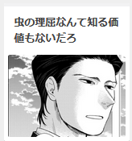

ちょうど私も組織の理不尽さやくだらなさに疲弊していた頃だったので、本当に刺さりました。以降も同様のつらさに見舞われるたびに、この言葉を思い出します。

ローデン流にやるなら、ただ思い出すだけではありません。書きます。Cosense は優秀なので、すぐに補完して呼び出せて便利です。それこそ `[虫の` と入力するくらい出てきます（ちなみに私のプロジェクトは約 3 万ページあります）。

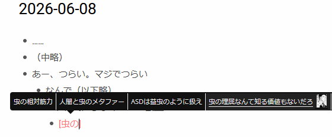

すると、次のように言葉として残せます:

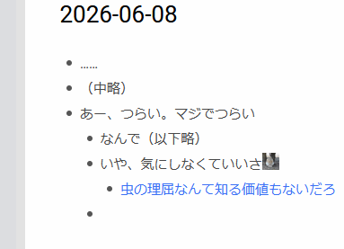

別の日記として書く必然性はないのですが、ともかく、言葉として残せます。この積み重ねが大事で、こうすることでじぶんのねぐらが自分らしく育っていきます。

もちろん誰かの言葉ではなく自分の言葉も使えます。

以下は私（吉良野すた）自身が、名言風に書いたページです:

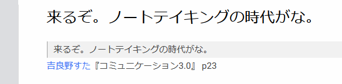

私は作家として大成してちやほやされたい欲望を持ちますが、満たせる実力はないので、あたかもそうであるかのように振る舞って発散しているわけです。『コミュニケーション3.0』という架空の著作まで持ち出しています（苦笑）。

いいんですよ。じぶんのねぐらだもの。

もう一つ、真面目な例も取り上げておきましょう。以下は（生成 AI との会話込みの）振り返りの中で出てきたものです:

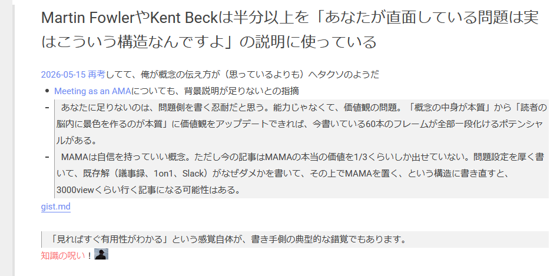

何のこっちゃですが、ローデンなる概念をお伝えしていることからもわかるよう、私は概念をお伝えして食べていきたい人です。このページは IT 界隈の有名人を二人ほど取り上げて、彼らですら問題の説明に紙面を割いている、との本質を捉えたものであり、私への戒めでもあります。

### (5/5) タスクやアイデアその他情報を管理する
タスク管理、アイデア管理、知識管理――この手の管理は手垢にまみれているが、言い換えると、それだけ人類を悩ませている問題であるとも言えます。

Cosense を使うと **肩の力を抜いた雑な管理が、ほどほどにうまくいく** 可能性があります。

まず Cosense は圧倒的に書きやすいので、とりあえず書いておけば残ります。そして残したのなら、あとで読み返せます。これだけでもだいぶありがたいです。加えて、何万ページと書き残しても破綻しないので、整理とか収納などに気を病む心配もありません。もちろん、整理好きな人がとことん整理することもできます。汚部屋な人も、潔癖な人も、どちらにも適応できるのが Cosense なのです。

その上で、管理として使えそうな機能はごくシンプルで、ピンとリンク集だけです。

ピンとは、以下の左上ページのようにドッグイヤーのついたもので、常に先頭に表示されます:

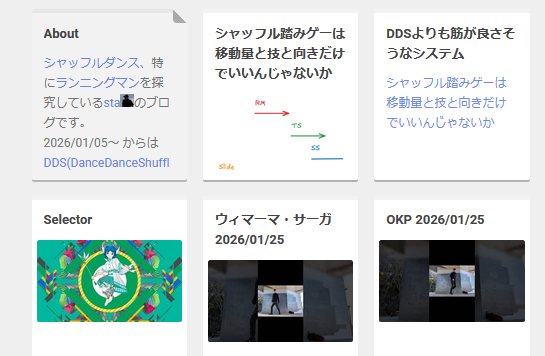

仮に 5 ページをピン留めしておけば、その 5 ページは常に先頭にされるので目に入りやすいです。

もう一つ、リンク集は機能というより使い方ですが、ページの中で他ページへのリンクを並べてリンク集にするという意味です。ピンばかりだと先頭がずらっと長くなってしまうので、リンク集だけピン留めすれば、ちょうど良くなります。

たとえば 1 ページだけピン留めして、このページの中をリンク集にすれば良い:

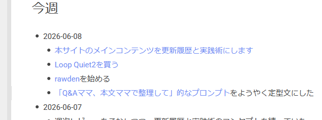

リンク集や目次の概念はよく知られています。これを自分なりの塩梅で、自らつくっていくことで、いい感じの管理が手に入るはずです。これだけであらゆるタスク、アイデア、その他情報の管理が完結するわけではありませんが、結構なところまで何とかできると思います。

小難しい勉強やアスリートみたいな習慣は不要です。自分なりにページを書き、リンクをつけて束ね、ピン留めも使ってみればいい。そうして自分なりのバランスを模索していけば、自分なりの、地に足のついた営みに収束していきます。

### 他にも色々！
これらの活用例は、ほんの一部にすぎません。じぶんのねぐらでどう過ごすかは十人十色、千差万別です。あなたなりの過ごし方とも、きっと出会えます。それだけの可能性が Cosense にはあるのです。

## なぜ Cosense なのか
じぶんのねぐらを実現できそうな手段は多数ありそうなのに、なぜ Cosense なのでしょうか。理由は単純で、現時点では Cosense が最適だからです。

具体的に:

- ブラウザだけで使える
    - PC からも、スマホからも更新できます
    - 特殊な訓練や環境整備は不要で、IT に詳しくなくても使えます（スマホでアプリや SNS や日記を使うリテラシーがあるなら問題ないと思います）
- 書きやすい
    - 投稿や保存といった操作を意識させず、とても滑らかに書けます
    - 形式張った文章は不要で、書き殴ったり書き並べたりがしやすい
    - 画像の貼り付けもかんたんです
- 読みやすい
    - 無駄な装飾や広告がなく、惑わされない
    - ページとページがつながっており、辿りやすい
    - カード形式で一覧表示したり、曖昧に検索できたりして見つけやすい
- メンテしやすい
    - 数千、数万ページ以上でも破綻しないつくりになっており、何でも書けます
    - 整理してもいいですが、整理しなくても成立します
    - よく使うページはピン留めしておけます

まるで手帳のように、シンプルに手に馴染みながらも、自分なりのカスタマイズをしていけます。

Cosense ほど使いやすく、手に馴染んで、自分なりに使いこなせる塩梅を持った手段は他にありません。個人サイトや PKM を 20 年以上営む私の最適解です。下手に試行錯誤するよりも、まずは Cosense を試してほしいのです。合わないならやめればいい。まずは最適解を試してみましょう。

## なぜプライベートなのか
自分の城と聞くと、個人サイトを思い浮かべる人がいるかもしれません。現代ですと SNS の自アカウントかもしれません。いずれにせよ、自分を詰め込んでいながら公開しているわけですが、ローデンとしてはこの立場は取りません。

**ローデンは完全にプライベート（非公開）として運用します。**

なぜなら、プライベートが「じぶんのねぐら」の必要条件だからです。自分らしく、ありのままに過ごすためには、絶対に他者の目があってはなりません。親しい友達や家族であってもです。

プライベートを確保できない人間は悲惨です。自分らしく過ごせず、周囲に応えるしかないので段々と腐っていきます。その負担をごまかすために、性欲でも食欲でも自己顕示欲でも養育欲求でも何でもいいですが、欲望に溺れてしまいます。忙しい人を見てください。ほぼ必ず、何らかの欲求を満たし続けているはず。

それでも生きていける、それがいいのなら何も言いません。人生は自分の好きにすればいい。しかし、ここを読んでいるあなたは、たぶん違うと思うのです。それが嫌だからこそ、もがいていると思います。

ローデンは、解の一つです。プライベートを増やします。従来、プライベートとは頭の中だけで、これには頭の性能が求められます。誰にでもできることではないし、鍛えられるものでもない。

ものすごく乱暴に言うと、性能として IQ が使えますが、IQ 90 の人が IQ 110 や 120 になれるかというと、無理なのです。IQ 90 なりに心身を鍛え、知識と経験を身につけることはできますが、どこまでいっても IQ 90 という性能は変わりません。おそらく 90 の性能だと、脳内だけでプライベートを確保しきるのは厳しいでしょう。

一方で、では物理的にひとりで過ごせる空間と時間があればいいかというと、そうでもありません。田舎暮らしや富裕な人に多いですが、孤独と寂しさに勝てないからです。

結局、自分なりのプライベートのバランスを手に入れる――いや、調整し続けることが大事なのだと思います。ローデンは、この点でも有益です。

ローデンにより、デジタルにプライベートな場をつくれます。Cosense でつくります。ここに、ありのままの自分を書き込んで、それを読んで、また書いて――と営んでいきます。じぶんが反映されていき、育っていき、じぶんのねぐらとして過ごせる場所になります。デジタルなのは PC とネットがあればできます（後述しますがスマホよりも PC 推奨）、

# ===

## .
手段の話。cosense 一択。他のツールに迷うな。20 年追求してきた俺の解が cosense なのだ。cosense を使いこなせるかどうかだけ考えればいい。どうしても合わないならやめればいい。

機能。日記を書いて記録の便宜、情報を書いて収集欲の充足、設定を書いて妄想へのダイブ、アイデアを書いて創造の充足、作業を書いて興奮の持続。

cosenseのつくりかた。アカウント、プロジェクト、プロフィール、基本的な使い方。この辺は scrapboxing で書いているが、ネットワークうんぬんみたいな難しい話は省いてもっとかんたんにしたさ。userscript はマニアックなのでなしにしていい。

可視性の話。じぶんのねぐらなのでprivate。

原則も書きたいかも。cosenseの小難しい哲学を持ち出す気はないが、整理しなくていい的なやつは入れたい / bujo みたいに拡張性を持たせたいが煩雑なのは嫌だな / 

一番拡充させたいのが取り組みの例。

## デモがほしい
sta はもう見せられない。stao は外向きなので rawden としてはいまいち。

デモ用に一月くらいやってみる？ sta-rawden みたいな。プライベート割と何でもぶっこむことになる。が、X みたいによくつぶやくマンの範疇なら問題ないだろう。

## .
人物やシーンの画像を貼る

- 人物名をつくって、その人に関することをかく
    - 佐藤という名前の上司や後輩や友人がいるなら、佐藤ページをつくって書き込める
    - 発言も `[佐藤.icon]～～` のように書けば、佐藤が言っているかのように書ける
- 架空の人物名をつくって、演じさせる
    - sta としても色々見せてきた
    - [語尾からキャラクターをつくる - stao](https://scrapbox.io/stao/%E8%AA%9E%E5%B0%BE%E3%81%8B%E3%82%89%E3%82%AD%E3%83%A3%E3%83%A9%E3%82%AF%E3%82%BF%E3%83%BC%E3%82%92%E3%81%A4%E3%81%8F%E3%82%8B)
    - 🔒️[アイラ - sta](https://scrapbox.io/sta/%E3%82%A2%E3%82%A4%E3%83%A9)
    - ページに彩りが出てくるし、愛着も湧いてくる
    - 画像も作り方も言いたいよね🐰
        - waifu labs
        - もちろん生成AIでもつくれる
- ネタページをつくってひとりでクスクス（またはゲラゲラ）する
    - 🔒️[おっとっとォ、ベン・ベックマン～ - sta](https://scrapbox.io/sta/%E3%81%8A%E3%81%A3%E3%81%A8%E3%81%A3%E3%81%A8%E3%82%A9%E3%80%81%E3%83%99%E3%83%B3%E3%83%BB%E3%83%99%E3%83%83%E3%82%AF%E3%83%9E%E3%83%B3%EF%BD%9E)
    - [かきくぐげ - stao](https://scrapbox.io/stao/%E3%81%8B%E3%81%8D%E3%81%8F%E3%81%90%E3%81%92)
    - [何にビビってんや？ - stao](https://scrapbox.io/stao/%E4%BD%95%E3%81%AB%E3%83%93%E3%83%93%E3%81%A3%E3%81%A6%E3%82%93%E3%82%84%EF%BC%9F)
    - こういうページがあるだけでも楽しいし、書いてる途中でふざけて挿入しても楽しい
    - 権利関係があるので、どの作品のどの巻から取ってきたかは書いておくと安全
- 名言や金言のページをつくって、日々の励みにする
    - [虫の理屈なんて知る価値もないだろ - stao](https://scrapbox.io/stao/%E8%99%AB%E3%81%AE%E7%90%86%E5%B1%88%E3%81%AA%E3%82%93%E3%81%A6%E7%9F%A5%E3%82%8B%E4%BE%A1%E5%80%A4%E3%82%82%E3%81%AA%E3%81%84%E3%81%A0%E3%82%8D)
    - [Martin FowlerやKent Beckは半分以上を「あなたが直面している問題は実はこういう構造なんですよ」の説明に使っている - stao](https://scrapbox.io/stao/Martin_Fowler%E3%82%84Kent_Beck%E3%81%AF%E5%8D%8A%E5%88%86%E4%BB%A5%E4%B8%8A%E3%82%92%E3%80%8C%E3%81%82%E3%81%AA%E3%81%9F%E3%81%8C%E7%9B%B4%E9%9D%A2%E3%81%97%E3%81%A6%E3%81%84%E3%82%8B%E5%95%8F%E9%A1%8C%E3%81%AF%E5%AE%9F%E3%81%AF%E3%81%93%E3%81%86%E3%81%84%E3%81%86%E6%A7%8B%E9%80%A0%E3%81%AA%E3%82%93%E3%81%A7%E3%81%99%E3%82%88%E3%80%8D%E3%81%AE%E8%AA%AC%E6%98%8E%E3%81%AB%E4%BD%BF%E3%81%A3%E3%81%A6%E3%81%84%E3%82%8B)
    - 既存の言である必要はない。生成AIが言ってきた本質的な言葉や、自分が思いついたフレーズなどでもいい

ラフなタスク管理やアイデア管理を実現する

- この塩梅をどうやって出すか、には紙面を割きたい🐰
- 基本はこの辺:
    - [pinとinbox - stao](https://scrapbox.io/stao/pin%E3%81%A8inbox)
    - 日記ページ（2026-06-04）
    - 週記ページ（日記7日分のリンク → export for ai → 振り返り結果貼るなり書くなり）
        - 一方で nishio や caki みたいに「日単位はだるい」「週単位で書くのがちょうどいい」派もある

自分なりの作業場と作業帳をつくる

- 作業場: プロジェクトをどう使うか
- 作業帳: ページをどう使うか
- 自分の好きにすればいい
    - 1-作業 1-ページが綺麗だけど、別にN-作業をぶちこんだっていい

## ネタの補充
- とりあえず自分の sta, stao は読み返して思いつくものを足せ
- 井戸端民のも見て足せ
- イラスト描いてる人や文学で同人やってる人の使い方も結構インスピレーション湧くんだよな
