raw den ― ありのまま書けばいい。じぶんのねぐらなんだから。 

2026-06-04 現在建設中です。UNDER CONSTRUCTION.

# 序文
ねぐら（塒）とは、鳥類が夜間に休息や睡眠をとる場所のことです。転じて、人間にとっての自分の家――特に隠れ家や秘密基地のニュアンスを指します。

鳥類はしばしば子育てのための「巣」と、夜を過ごすための「ねぐら」を分けます。同様に、人間も、ありのままの自分で過ごせる場所が必要なのでしょう。レイ・オルデンバーグがいう「サードプレイス」も近いですが、私は少し異なると考えます。

ねぐらは聖域です。自分以外の、一切の侵入を許さない、自分のためだけの空間と言えます。なぜなら他者の存在を気にしないことで、はじめて、ありのまま（生のまま）過ごせるようになるからです。

サードプレイスとは違います。サードプレイスは気分転換にすぎない。カフェや書店等が挙げられますが、本質的に他者も存在している。そうではなく、私たちは時として解放されたいのです。そのためには、ありのまま過ごせる場所が必要ですが、物理的な場所の確保は難しいし、確保しても通い続けるのが難しい。だからこそ、デジタルな場に目を向けることになります。

私は 20 年以上、「じぶんのねぐら」を追求してきました。まがいなりにも、この現代において正気を保てているのも、ねぐらのおかげです。一方で、正気を保てず苦しむ人も多いように見受けられる。「じぶんのねぐら」をもっと広めてみたいと考えました。

私が考える「じぶんのねぐら」と、そのつくりかたを紹介したい。rawden と名付けました。raw（生のまま） + den（ねぐら）から来ています。読み方は **ローデン** です。

自分の、自分による、自分のためのねぐらを。ローデンを、一緒につくっていきましょう。

# === 第１部：紹介する ====
ローデンとは何か。じぶんのねぐらとはどういうことなのか。また、なぜ Cosense というツールを使うのか――まずはこのあたりのイメージをつかんでいただこうと思います。

# ねぐらとは、どのようなもの？

## Cosense を使った箱庭
このようなものです。


※ボリュームを示すため＆プライベートな内容を伏せるために圧縮表示しています。本当はもっと見やすいです

一言で言えば **Cosense（旧Scrapbox）を使ったプライベートプロジェクト** を使います。Cosense はウィキと呼ばれるもので、プロジェクトという箱の中に、好きなだけページをつくれます。ねぐらですので、他の人には見せず、したがってパブリック（公開）ではなくプライベート（自分のみ）としてつくります。

また、ねぐらは（箱は）一つとは限りません。一つにすれば何でも詰めれて楽ですが、ごちゃごちゃします。複数に分けると、箱ごとの使い分けを明確にできますが、どの箱に入れようか？どの箱を見ようか？といった迷いが生じやすくなります。

どちらでもいいですし、迷っていいんです。ねぐらは、長い時間をかけて営んでいくものと思います。箱をいくつ抱えるか、という点も含めて楽しんでいきましょう。

## なぜ Cosense なのか
じぶんのねぐらを実現できそうな手段は多数ありそうなのに、なぜ Cosense なのでしょうか。理由は単純で、現時点では Cosense が最適だからです。

具体的に:

- ブラウザだけで使える
    - PC からも、スマホからも更新できます
    - 特殊な訓練や環境整備は不要で、IT に詳しくなくても使えます（スマホでアプリや SNS や日記を使うリテラシーがあるなら問題ないと思います）
- 書きやすい
    - 投稿や保存といった操作を意識させず、とても滑らかに書けます
    - 形式張った文章は不要で、書き殴ったり書き並べたりがしやすい
    - 画像の貼り付けもかんたんです
- 読みやすい
    - 無駄な装飾や広告がなく、惑わされない
    - ページとページがつながっており、辿りやすい
    - カード形式で一覧表示したり、曖昧に検索できたりして見つけやすい
- メンテしやすい
    - 数千、数万ページ以上でも破綻しないつくりになっており、何でも書けます
    - 整理してもいいですが、整理しなくても成立します
    - よく使うページはピン留めしておけます

まるで手帳のように、シンプルに手に馴染みながらも、自分なりのカスタマイズをしていけます。

Cosense ほど使いやすく、手に馴染んで、自分なりに使いこなせる塩梅を持った手段は他にありません。個人サイトや PKM を 20 年以上営む私の最適解です。下手に試行錯誤するよりも、まずは Cosense を試してほしいのです。合わないならやめればいい。まずは最適解を試してみましょう。

## なぜプライベートなのか
自分の城と聞くと、個人サイトを思い浮かべる人がいるかもしれません。現代ですと SNS の自アカウントかもしれません。いずれにせよ、自分を詰め込んでいながら公開しているわけですが、ローデンとしてはこの立場は取りません。

**ローデンは完全にプライベート（非公開）として運用します。**

なぜなら、プライベートが「じぶんのねぐら」の必要条件だからです。自分らしく、ありのままに過ごすためには、絶対に他者の目があってはなりません。親しい友達や家族であってもです。

プライベートを確保できない人間は悲惨です。自分らしく過ごせず、周囲に応えるしかないので段々と腐っていきます。その負担をごまかすために、性欲でも食欲でも自己顕示欲でも養育欲求でも何でもいいですが、欲望に溺れてしまいます。忙しい人を見てください。ほぼ必ず、何らかの欲求を満たし続けているはず。

それでも生きていける、それがいいのなら何も言いません。人生は自分の好きにすればいい。しかし、ここを読んでいるあなたは、たぶん違うと思うのです。それが嫌だからこそ、もがいていると思います。

ローデンは、解の一つです。プライベートを増やします。従来、プライベートとは頭の中だけで、これには頭の性能が求められます。誰にでもできることではないし、鍛えられるものでもない。

ものすごく乱暴に言うと、性能として IQ が使えますが、IQ 90 の人が IQ 110 や 120 になれるかというと、無理なのです。IQ 90 なりに心身を鍛え、知識と経験を身につけることはできますが、どこまでいっても IQ 90 という性能は変わりません。おそらく 90 の性能だと、脳内だけでプライベートを確保しきるのは厳しいでしょう。

一方で、では物理的にひとりで過ごせる空間と時間があればいいかというと、そうでもありません。田舎暮らしや富裕な人に多いですが、孤独と寂しさに勝てないからです。

結局、自分なりのプライベートのバランスを手に入れる――いや、調整し続けることが大事なのだと思います。ローデンは、この点でも有益です。

ローデンにより、デジタルにプライベートな場をつくれます。Cosense でつくります。ここに、ありのままの自分を書き込んで、それを読んで、また書いて――と営んでいきます。じぶんが反映されていき、育っていき、じぶんのねぐらとして過ごせる場所になります。デジタルなのは PC とネットがあればできます（後述しますがスマホよりも PC 推奨）、

# ねぐらを覗く
ここでローデンの例として、私の使い方を 5 点ほど紹介します。

## (1/5) 日記を書く


地味ですが、便利で楽しい使い方です。

たとえば次のようにします:

- 2026-06-08 のように日単位でページをつくって日記を書きます
- 1 週間ごとに、7 日分のページを束ねたリンク集をつくって、週記にします
- 1 ヶ月ごとに、4～5 週間分のページ（週記が 4～5 ページあるはず）を束ねたリンク集をつくって、月記にします

こうすれば日記を書きつつも、週単位・月単位で読み返せます。振り返りをしてもいいですね。

私は真面目な使い方をしていて、日記として「何をやったか」「どう思ったか」を記録しています。フリーフォーマットで、X のようにつぶやく感じ。そして週ごとに束ねて振り返り、さらに月ごとに束ねて振り返っています。そうすることで人生に規律を与えています。

他には、単に日単位で写真メインの日記を何年も書いている人もいますし、日単位だとだるいので週単位からスタートして 7 日分の日記を書く人もいます。

## (2/5) オリジナルキャラクターをつくって動かす
ローデンはじぶんのねぐら、じぶんだけのねぐらですので、思いつきから妄想まで何でも込められます。

以下は私が [Waifu Labs - Magical Anime Portraits](https://waifulabs.com/) でつくった、いわゆる「俺の嫁」です:


Cosense でページに画像を貼ると、アイコンとして挿入できるようになります。これを使うと、本文中でその自分が語っているかのような書き方ができます。

以下を見てください。下品なボケ方に対して、アイラからツッコミが入っています:


そして私が「ごめん」と謝っていますね。**これらは自作自演であり、ひとり芝居を書いてやっているようなもの** ですが、いいんです。じぶんのねぐらだもの。

もちろん楽しみ方もこれだけではないです。私は自分を主人公にして、良い思いをさせるようにつくるのが好きですが、自分は排除してキャラ同士の掛け合いが見たい人であれば、掛け合いを書けば良い。絵にしても、私のようにWebサービスでつくらせて済ます人もいれば、自分で描いたっていい。

## (3/5) 人のページをつくってあれこれする
人はゴシップが好きですし、あれこれ言いたくもなりますが、社会人として堂々と行うわけにもいきません。ローデンならできます。

たとえば佐藤明（例です）さんについて書きたいなら、佐藤明ページをつくって、イラストや写真があればそれも貼り付けて、その上であれこれ書けます:


じぶんのねぐらなので何を書いてもいいです。

- ファンの立場で推しのページをつくって、思いを書きまくる
- 自分の周囲の人間を全部ページ化して、読みながら立ち回りを考える。そのために書き足す
- むかつく人のページをつくって、なぜむかつくかを書き殴ったり考察したりする
- 名刺管理やエピソード管理として、出会った人物やエピソードを淡々と記録する etc

## (4/5) 名言や格言のページをつくって、励みにする
名言、金言、格言といった言葉と接さずに過ごせる人は稀でしょう。人生はそれなりに心躍るものであり、絶望するものでもあると思います。誰かの言葉によって励まされることはあるはず。

ローデンならば、これらを持続的に捉えられます。

以下はマンガ『フラジャイル 25巻』からの引用です（厳密には少し表現を変えてますが）:


ちょうど私も組織の理不尽さやくだらなさに疲弊していた頃だったので、本当に刺さりました。以降も同様のつらさに見舞われるたびに、この言葉を思い出します。

ローデン流にやるなら、ただ思い出すだけではありません。書きます。Cosense は優秀なので、すぐに補完して呼び出せて便利です。それこそ `[虫の` と入力するくらい出てきます（ちなみに私のプロジェクトは約 3 万ページあります）。


すると、次のように言葉として残せます:


別の日記として書く必然性はないのですが、ともかく、言葉として残せます。この積み重ねが大事で、こうすることでじぶんのねぐらが自分らしく育っていきます。

もちろん誰かの言葉ではなく自分の言葉も使えます。

以下は私（吉良野すた）自身が、名言風に書いたページです:


私は作家として大成してちやほやされたい欲望を持ちますが、満たせる実力はないので、あたかもそうであるかのように振る舞って発散しているわけです。『コミュニケーション3.0』という架空の著作まで持ち出しています（苦笑）。

いいんですよ。じぶんのねぐらだもの。

もう一つ、真面目な例も取り上げておきましょう。以下は（生成 AI との会話込みの）振り返りの中で出てきたものです:


何のこっちゃですが、ローデンなる概念をお伝えしていることからもわかるよう、私は概念をお伝えして食べていきたい人です。このページは IT 界隈の有名人を二人ほど取り上げて、彼らですら問題の説明に紙面を割いている、との本質を捉えたものであり、私への戒めでもあります。

## (5/5) タスクやアイデアその他情報を管理する
タスク管理、アイデア管理、知識管理――この手の管理は手垢にまみれているが、言い換えると、それだけ人類を悩ませている問題であるとも言えます。

Cosense を使うと **肩の力を抜いた雑な管理が、ほどほどにうまくいく** 可能性があります。

まず Cosense は圧倒的に書きやすいので、とりあえず書いておけば残ります。そして残したのなら、あとで読み返せます。これだけでもだいぶありがたいです。加えて、何万ページと書き残しても破綻しないので、整理とか収納などに気を病む心配もありません。もちろん、整理好きな人がとことん整理することもできます。汚部屋な人も、潔癖な人も、どちらにも適応できるのが Cosense なのです。

その上で、管理として使えそうな機能はごくシンプルで、ピンとリンク集だけです。

ピンとは、以下の左上ページのようにドッグイヤーのついたもので、常に先頭に表示されます:


仮に 5 ページをピン留めしておけば、その 5 ページは常に先頭にされるので目に入りやすいです。

もう一つ、リンク集は機能というより使い方ですが、ページの中で他ページへのリンクを並べてリンク集にするという意味です。ピンばかりだと先頭がずらっと長くなってしまうので、リンク集だけピン留めすれば、ちょうど良くなります。

たとえば 1 ページだけピン留めして、このページの中をリンク集にすれば良い:


リンク集や目次の概念はよく知られています。これを自分なりの塩梅で、自らつくっていくことで、いい感じの管理が手に入るはずです。これだけであらゆるタスク、アイデア、その他情報の管理が完結するわけではありませんが、結構なところまで何とかできると思います。

小難しい勉強やアスリートみたいな習慣は不要です。自分なりにページを書き、リンクをつけて束ね、ピン留めも使ってみればいい。そうして自分なりのバランスを模索していけば、自分なりの、地に足のついた営みに収束していきます。

## 他にも色々！
これらの活用例は、ほんの一部にすぎません。じぶんのねぐらでどう過ごすかは十人十色、千差万別です。あなたなりの過ごし方とも、きっと出会えます。それだけの可能性が Cosense にはあるのです。

# === 第２部：導入する ====
第２部では、実際に Cosense でプライベートプロジェクトをつくってみます――と書いたものの、詳しい手順は割愛しています。どちらかと言えば、ローデンを始めるのに足るかどうかの判断材料を書いています。

# ローデンをつくってみる
実際に Cosense でローデンをつくってみましょう。といっても、これは「Cosense でプライベートプロジェクトをつくってみよう」と同義です。

## 用語の整理
- Cosense
    - ウィキに属する Web サービス
    - 非公開の、自分用のウィキもつくれる
- プロジェクト
    - Cosense でつくる「箱」の単位
    - ひとりあたり何個でもつくれる
- ページ
    - プロジェクトの中につくる情報単位
    - タイトルと本文から成る
    - `[A]` のように書けば、タイトルAにリンクを張れる（つながりをつくれる）

## 大まかな手順
個人利用であれば無料でも制限なく使えます。

- 1: Cosense のアカウントをつくる（Google 連携可能）
    - → 公式サイト: [https://scrapbox.io/](https://scrapbox.io)
- 2: 最低限の設定をする（アバターやユーザー名など）
- 3: プライベートプロジェクトを一つつくる
- 4: つくったプロジェクトで、最低限の設定をする（プライベートにする、テーマを変える、画像保存先を Gyazo にする等）

詳しい手順は割愛します。

一種のハードルと考えてください。Cosense はデジタルツールであり、そこそこの IT リテラシーが求められます。本サイトでは **読者がひとりで Cosense を新しく始められる程度の能力を持っていることを期待します**。

期待に達していない方は、まずは達してください。一応、私が昔書いた電子書籍もあります。また調べれば他にも解説記事や書籍はヒットします。

- [Amazon.co.jp: Scrapboxing(スクラップボクシング) 電子書籍: 吉良野すた: Kindleストア](https://www.amazon.co.jp/dp/B09YLFQZ29)

ちなみに Scrapbox から Cosense に改名した過去があるので、「Cosense」だけでなく「Scrapbox」で調べてみるのもアリです。

## （期待に達していない方へ）
ローデンは Cosense を使い続けるものであり、Cosense を使い続けるには相応の能力が求められます。この点について、もう少し詳しく言語化しておきましょう。

正直言うと、万人向けではありません。誰もがパートナーやペットと暮らしたり、都会で狭い賃貸住宅で暮らしたり、毎日日記を書いたりできないように、ローデンという「Cosense のプライベートプロジェクトで過ごす」営みも、誰でもできるとは限らない。

より具体的には、以下がすべて求められます:

- A: ひとりで Cosense を開始できる程度の IT リテラシーおよび道具を持っていること
    - アカウントをつくって、ログインして、プロジェクトをつくって設定もして、といった基本的な素養
    - PC とネット環境を持っており、このようなことを問題なく行える環境にいること
- B: 1 日 1000 文字以上、何か書くことを持続的に行えること
    - 忙しい、飽きた、など理由があればやらないのはいいとして、やろうと思えばまあできるよねという程度ではあること
- C: 1 日 1 時間以上、自分以外は誰も見ない場所での読み書きに時間を費やせること
    - こればっかりは性格、興味、特性次第なので何とも言えません
    - 1 時間運動できる人とできない人がいたり、1 時間読書できる人とできない人がいたりするのと同じです

A については、基礎素養と環境の話です。無い場合は、まずは身に付けてから・手に入れてから、の話となります。スマホのリテラシーがないとスマホアプリを使えないのと一緒です。

B については、ある程度の入力が行えるかという話です。PC の場合、おそらくキーボードでしょう。スマホでも可能ですが、個人的には推奨していません。1000 文字という数字は適当ですが、慣れているなら（書けない・描きたくないなど心理的な理由はもちろんあるにしても）問題ないはず。逆に、1000 文字なんて無理だよー、という人は、おそらく入力のスキルが足りておらず、鍛えた方が良いでしょう。

※スマホについては後述します。ただ私はスマホには詳しくない（一日全く触らない日もあるくらいほとんど使わない）分、PC に頼りがちなので、スマホに馴染んでいる方はスマホでいいと思います。じぶんのねぐらであり、自分なりに使えばいいので、どうとでもなるはず。

C については、運動や読書やゲームなど何でもいいですが、適性の話になります。ローデンは「じぶんのねぐら」と題するとおり、誰にも見せず、ひとりで静かに、孤独に「読み書き」をする営みです。とても地味で、静かなものです。ローデンをやるなら、今後この過ごし方とずっと向き合っていくことになります。「1 日 1 時間」は目安ですし、忙しいとそこまで時間を取れませんが、事情はさておき、これから 1 日 1 時間、こういう営みに費やせるか？費やしてみたいか？という話です。反射的に「いやそんなの嫌だよ」って人は、おそらく向いていません。

期待に達していない方でも、やってみれば案外何とかなるかもしれません。ダメならやめればいいのです。ただ、ある程度やってみるのにも相応の時間はかかるので、参考として、こうしてハードルを言語化しています。

## PC vs スマホ
私は Cosense は PC で使って欲しい派ですが、スマホでも可能だと思います。すでに述べたとおり、私は PC ユーザーであってスマホはほとんど使っていないため PC ひいきの目線になっています。一方で、読者の中には、スマホネイティブな人も多いでしょう。

PC をおすすめする理由は単純で、入力の早さと画面の広さで勝っているからです。

まずキーボードが使えるので入力しやすいですし、マウスも使えるので操作もしやすい。もっともここは慣れの問題で、スマホでも同等レベルの操作はできるかもしれません。

一番の違いは画面の広さだと思います。PC だと大きなウィンドウを複数枚並べたり、ブラウザでタブを何枚も並べたりできるので、とても快適です。そして画面が広いということは、それだけ目に入る情報も増やせるし（並べ方次第で）調整もできるというわけで **結果的に書きやすさにもつながります。**

よく机の広さでたとえられますが、机は広い方が色々置けて便利です。PC とスマホもそうで、PC は L 字デスク、スマホは机すらなくてリュックを前がけしているようなものでしょう。前がけでもある程度は何とかなるでしょうが、L 字デスクの方が広いし、置けるし、で便利なはずです。

しかし、一概に PC が良いとも言えない。人生経験や生活スタイル次第でもあります。私は 20 年以上の PC ユーザーであり、スマホが登場する前から PC に習熟したため PC を使う方に寄せます。また、人との交流や外出も苦手で、基本的に自宅のデスクで完結させたいという性分もあります。一方で、スマホネイティブかつ移動も多い人になると、逆にスマホこそ必須でしょう。

というわけで、結論は出ていませんが、どちらでも良いと思います。ただ私としては、腰を据えて広い環境でじっくり読み書きできる PC を推します。じぶんのねぐらも、ひとりでじっくりやるものなので、だったら環境面から寄せていった方がいいのではとも思っています。が、スマホを知らない私がこれ以上 PC を推しても野暮でしょう。どちらでもいいと思います。

# プロジェクトをどうつくるか
ローデンはじぶんのねぐらなので、好きにつくれば良いですが、快適に使うための設定や原則もありますのでご紹介します。

## 基本的に入れておきたい設定

### プロジェクトをつくるとき
まずはプロジェクトをつくるときですが、もちろん private project です。URL についても、規則性をもたせた方があとから管理しやすいです。私は `sta-` を先頭につけてます。

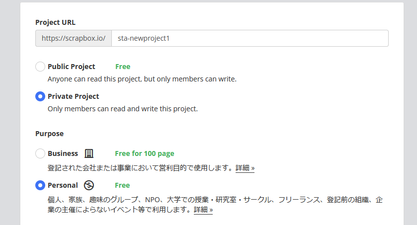

画像の保存先は、gyazo.com を推奨します。

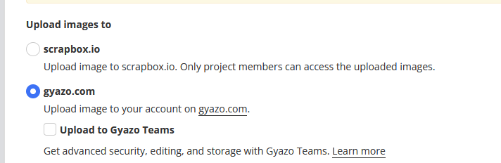

Gyazo.com を選ぶと、自分の Gyazo アカウントに保存されるようになって一元管理できます。どのプロジェクトからでも表示できますし、 **プロジェクトを消しても画像が消えません**。一方、scrapbox.io だと、プロジェクト単位で保存するので、プロジェクトを消したら画像も消えます。これではやりづらいので、Gyazo にしてしまうのがおすすめです。

ただし **Gyazo にアップロードした画像は、URL がわかれば誰でも見れますので管理には注意** してください。画像の URL を他者に見せないように。この点を防ぎたければ、Gyazo の有料プランを買ってください。

### プロジェクトをつくったあと
つくった直後は、以下のようになっています。

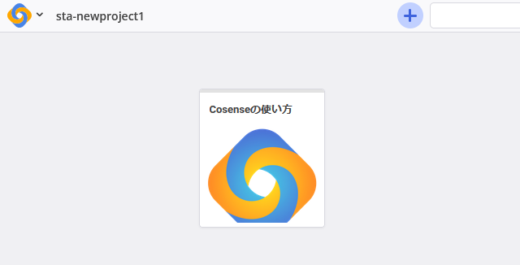

好みな部分もありますが、私は以下のようにしています。

- Cosenseの使い方」ページは邪魔なので消す
- 自分のページを作成する
- About ページを作成する、またピン留めする

以下スクショつきで説明します。

「Cosenseの使い方」ページは邪魔なので消す:

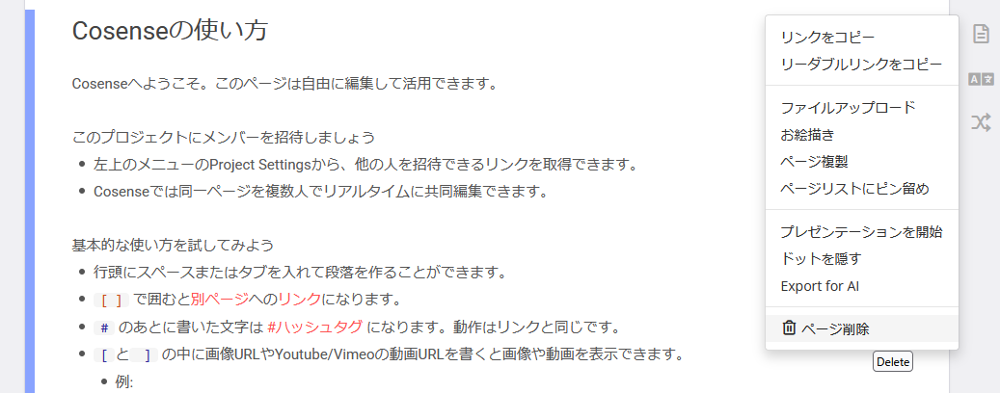

右上から「自分のページを作成する」:

※なお言語は「言語設定 / Languages」から日本語にできます。

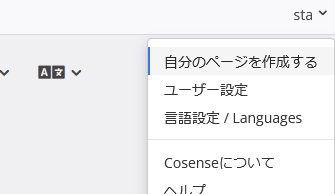

次のようなページが出来ますが、ここは今後何回もつくることになるので、テンプレートをつくっておくといいでしょう。

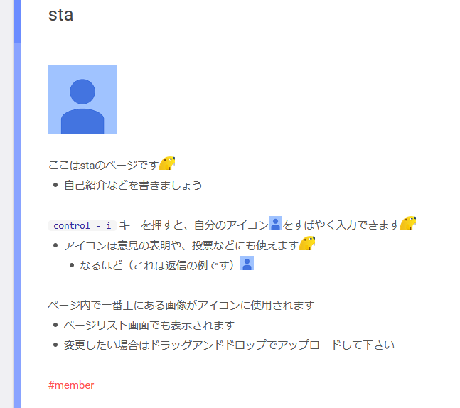

私は次のようにしています。自分のアバター + UserScript と UserCSS のシンプル構成。

※なお UserScript と UserCSS について説明しませんし、本サイトでは取り上げません。なくてもローデンは成立します。どうしても気になる人は各自調べてください。UserScript はプロジェクトの挙動を、UserCSS は見た目を変える手段ですが、どちらもスクリプトを書くので高度です。一応少しだけ後述します。

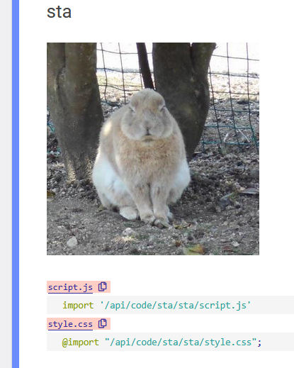

もう一つページをつくります。About ページをつくって、ピン留めしておきます。

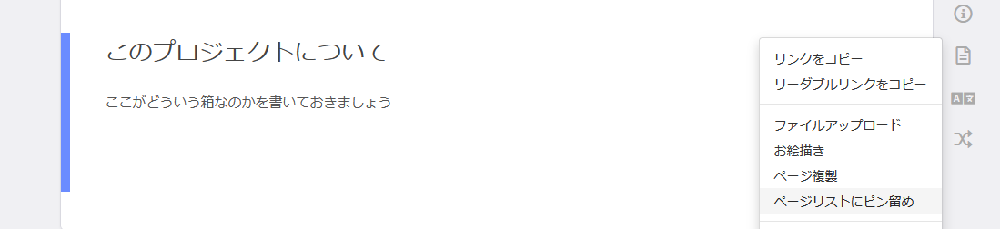

あとはテーマも必要なら変えましょう。好きな色にしてもいいですし、プロジェクトの傾向ごとに自分なりにルールを決めてもいいでしょう。ローデンではプライベートプロジェクトだけつくりますが、人によってはパブリックなプロジェクトもつくっているはずで、もしそうなら、この違いで色を分けておくと「間違ってパブリックに書いちゃった」を防ぎやすくなります。

私もパブリックなプロジェクトを持っていますが、パブリックなものは赤にしています。逆にプライベートなものは Light や Minimul などメタル系にしています。

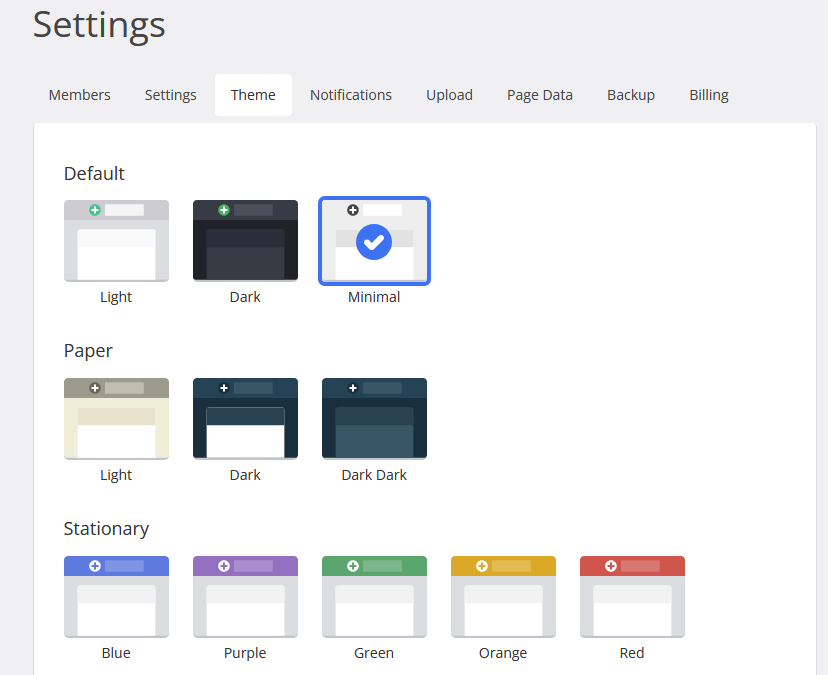

ここまで終わると、プロジェクトの画面はこんな感じになります:

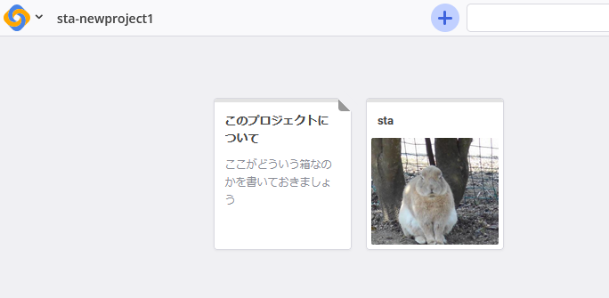

あとは自分のローデンをつくっていくだけです！

## プロジェクトを何個つくるか
ローデンとは「Cosense のプライベートプロジェクト」を使ったねぐらでした。では、プロジェクトは何個つくればいいのでしょうか？

### 原則と、最初のおすすめ
まず正解は無く、人によって最適解は変わります。また同じ人であっても、時間が経てば変わります。それでも大まかには二通りあります。

- 1: プロジェクトを一つだけつくって、何でも詰め込む
- 2: 用途ごとに異なるプロジェクトをつくる

私としては、まず 1 の「何でも詰め込むホーム的なプロジェクト」をつくることをおすすめします。とりあえず訪れて、とりあえず書く場所。これが最もシンプルな使い方であり、これ以上複雑にすると、そもそも Cosense の扱いに挫折してしまうかも。

2: の用途ごとは、慣れてからでもいいのです。

### 私の現状
参考までに、私の現状も書いておきます。

以下 3 つのローデンがあります。

- /sta: 何でも詰め込む「ホーム」。現在約 3 万ページ
- /stary: 日記、週記、月記を書いている「振り返り用」。
- /sta-private: お金、紛争、アダルトなど生々しい話を扱う「特別室」。

/sta は元々パブリックにしていましたが、事情があって現在プライベートになりました。それ以降は外に見せられない情報も置くようになり、もうパブリックにはできません。普段はここで過ごしています。

/stary は 2026 年から開始したもので、日記として「いつ何をやったか」「どう思ったか」を淡々と記録したものです。週ごとに 7 日分を見返して振り返り、その結果を書き込みます。月ごとに 4～5 週分を見返して振り返り、その結果を書き込みます。年末年始時に、12 か月分を見返して振り返り――と、日 → 週 → 月 → 年の順で段階的に振り返りをしています。

これにより、私自身の傾向や思いを改めて知ることができ、仕事でも生活でも生きやすくなります。私は不器用な人間で、世間の標準についていくのが難しいし、誰かと親しくしてフィードバックをもらうような生活もできません。どう生きるかを自分で決めねば破滅します。自分についての深い理解が必要で、stary はその役に立ちます。

/sta-private は特別室と銘打っていて、生々しいネタを置いています。画面を覗き見されたら一発で関係が壊れるような、本当に生々しい情報を置いています。詳しくは割愛したいですが、たとえるなら「R-18 の同人誌を描いていて、同僚をネタにしていて、そのイラストも貼っている」みたいなものです。同僚に見られたらアウトですし、そもそも公の場で他者に見られていいものでもない。

### センシティブなローデン
重要なのでもう少し取り上げます。

このように **ローデンでは「画面を一瞬でも見られたらまずいもの」を扱うこともあります** が、このようなセンシティブなものは、それ用のプロジェクトをつくってそこに集めた方がいいです。

そうしないと、外出先でローデンを読み書きしづらくなります。あなたがよほど恵まれた生活をしているか、仙人のような生活をしているのでもない限り、それなりに外出や待ちはあるはずです。電車や待合室で待っているときにローデンを読み書きする、なんてこともあるあるです。

もし普段のローデンにセンシティブなページが混ざっていると、外で開くたびに気にすることになってストレスです。ですので、センシティブなローデンをつくって、そこに置くことを徹底してください。これはこれで「普段のローデンにはセンシティブなことは置かない」との判断が逐次必要で、面倒くさそうですが、慣れます。

## UserScript と UserCSS について
Cosense のウリの一つが UserScript と UserCSS です。

どちらもスクリプトを書くことで、よりきめ細かい挙動や見た目をつくれます。

ローデンにおいては、これらは無くても問題ありません。一方で、プログラミングが好きなエンジニアまたは類似した趣味の持ち主は UserScript によるカスタマイズも、営みの一つになるかもしれません。また、見た目にこだわりたい人は、UserCSS は避けては通れません。そういった人は、ご自身で勉強してください。本サイトでは取り上げません。

私としては、これらにこだわるのは二の次と考えています。私が「インテリアよりも機能性」派ということもありますが、ローデンにおいて重要なのは機能だからです。日々、ページとして何を書き、読み、書き足すのか。書き直すのか。その営みこそがローデンをつくるのです。スクリプトで挙動や見た目をカスタマイズする、というのはインテリアの話であって、本質ではない。

しかし、インテリアこそがローデンの本質でしょ、と考える人もいるでしょう。むしろそっちの派が多いかもしれない。であれば、UserScript と UserCSS がないと割と何も出来ないと思うので、おとなしく学びましょう。ただ私はそうじゃないので、本サイトでもこれ以上は取り上げません。

## データのバックアップ
「プロジェクトをどうつくるか」とは少し離れますが、最後に重要な話――データのバックアップについて取り上げます。

Cosense に限らず **Web サービスはサービスが死んだらデータもなくなるので、手元に持っておくことは大事です**。また、うっかり誤操作をして「もとに戻したくなる」こともあるかもしれない。

幸いにも Cosense は丁寧につくられています。まずプロジェクト設定から、全ページのデータをエクスポートできます:

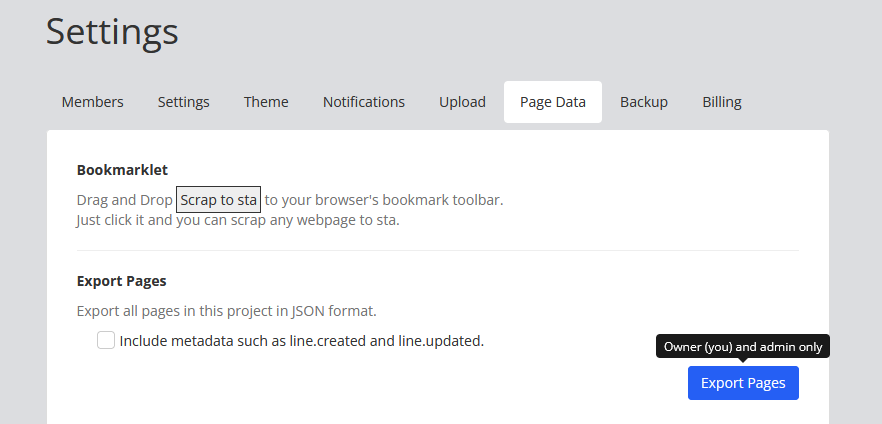

あるいは次のような URL をブックマークしておくと、エクスポートしたいときにすぐ呼び出せて便利です。

- `https://scrapbox.io/api/page-data/export/(プロジェクト名).json?metadata=false`

……と、このやり方だと手作業が必要で面倒ですが、実は日ごとにバックアップが取られています。同じくプロジェクト設定から見ることができます:

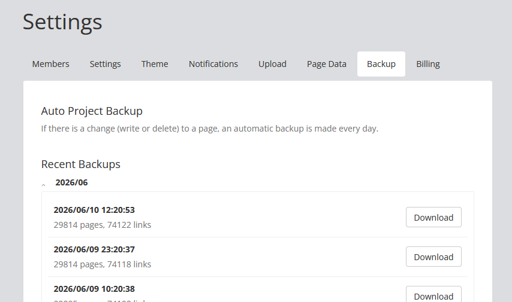

何かあったときに復旧したい、という場合、こちらを使えばいいでしょう。

また、バックアップの他にリストア――バックアップしたデータから復旧させる手順も、一度やっておくと安心かもしれません。インポートも同じく、プロジェクト設定から行えます:

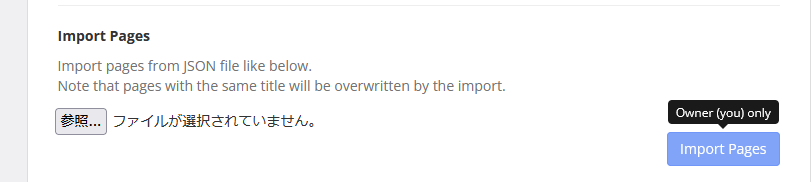

試したい場合は、適当なプロジェクト A をつくり、適当にページをつくった後、いったんエクスポートしてから A を消します。もう一度、新しいプロジェクト B をつくった後、プロジェクト設定から A のデータをインポートをしてみましょう。これで B に A のページが読み込まれるはずです。

※画像のアップロード先は Gyazo であり、この点も考えねばなりませんが、本サイトでは割愛します。

# === 第３部：ねぐらを広げる ===
ここからは実際にねぐらをつくっていきましょう。

実は、ローデンのご紹介は第２部までで終えています。あとはご自分の思うがままに過ごしていけばいいのです。しかし Cosense は 10 年を迎え、便利な使い方や楽しい使い方も開拓されてきました。知っておくと便利でしょう。

というわけで、主な使い方を取り上げていきます。興味のある使い方を深堀りしてみてください。

# 日記、振り返り、動線
ローデンを定着させたいなら、とにもかくにも「読み書きする機会を増やす」ことです。日記から始めましょう。

## 日記
最もわかりやすいのは日記でしょう。毎日その日の出来事や思ったことなどを書いて、日で区切る。

区切り方は好きにして構いません。日単位で律儀に区切ってもいいですし:

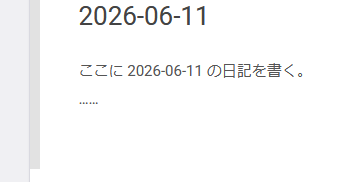

もう少し粗く、たとえば週くらいの粒度で区切っても良い:

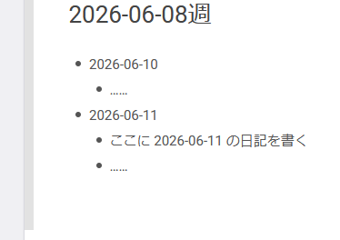

しかしながら日、週、月のような区切り自体は導入した方が良いと思います。人間の認知能力は限られていて、区切ることでセーブしています。ご存知のとおり、時間軸は親しみやすい区切りであり、きりも良い。

またローデンでは（というより Cosense）では、自分なりにページをつくったりリンクしたりして「整理していく」ことがほぼ必須となるので、この日記的な使い方は試金石にもなります。

**あなたはこれくらいの運用ができる側の人なのか、それともできない側の人なのか。**

ローデンに向いているのは「できる側の人」です。とはいえ整理できなくても問題ありません。それこそ未整理で、単に雑にページをつくっただけのプロジェクトであってもローデンです。あなたのねぐらです。好きにすればいい。

ただ、中長期的に末永く付き合っていくなら、自分なりの整理ができた方が続きます。**整理とは迷わないこと** だと思います。片付けるという意味ではなく、自分なりに迷わず動けるならそれでいい。日記的な運用は、その初歩として最適な題材です。

## 日記として何を書くか
日記的な使い方の「形式」よりも「中身」――つまり何を書けばいいか、に迷う人も多いかと思います。

私としては「子供が無目的に遊ぶように、思うままに書いてみればいい」と言いたいですが、私たち大人はなかなか子供のようには動けません。

中身のネタをいくつか挙げておきます:

- 記録を書く
    - やったこと（実際に行った行動）
    - 行った場所、買ったもの、読んだもの等は書きやすい
    - 最初はキーワードだけでもいい
- 考えを書く
    - 思ったことや考えたことを書く
    - 疑問でも、アイデアでも、感想でも
    - あるいは書きながら考えていっても良い（むしろローデンの主な用途です）
- 作業を書く
    - タスクや TODO という堅苦しいですが、やることを書いてみる
    - やりたいこと、やるべきこと、やった方がいいことなど色々はあるはず
    - また、少し時間を置いて、どれができたか・できてないかなども書くといいでしょう

## 日記を束ねる
日記が定着してきたら、日記ページを束ねてみましょう。

たとえば 2026-06-11 ページのように日単位でつくっている場合、週ごとに束ねてみましょう。私は毎週日曜日に「週単位で束ねるページ」をつくるのが好きです。以下は 2026-06-14（日曜日）ページをつくって、先週日曜日から今週土曜日までを束ねています:

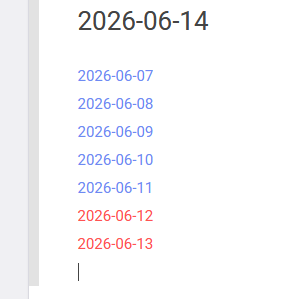

束ねることのメリットは三つほどあります。

一つは俯瞰できること。この場合、「今週の振り返り」ができるようになります。それぞれの日を読みに行けばいいからです。通常、単に一週間を思い返すよりも（日記として書いて残っているので）高精度に思い出せます。

次に、あとで整理や発見がしやすくなること。Cosense はページとページをリンクでつないでネットワークをつくるものであり、ネットワークの自由な行き来や修正が肝ですが、こういう「束ねたページ」はハブにあたります。交差点や広場と言ってもいい。ハブをつくっておくと、あとあとページを巡っているときに見つかりやすい。

最後に、生成 AI です。後述しますが、Cosense には Export For AI 機能があって、「今開いているページ」と「そのページと直接繋がっているページ（1-hop）」をまとめてエクスポートできます:

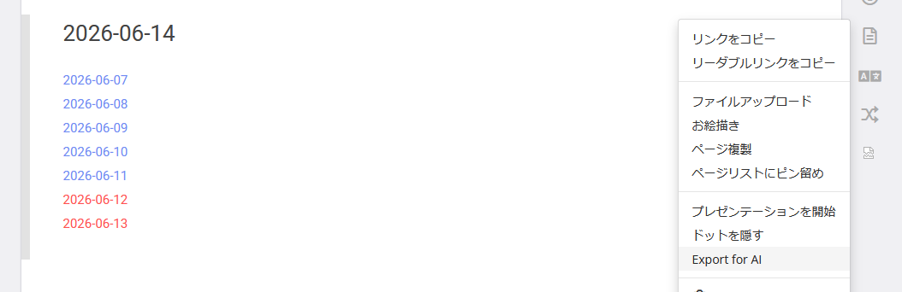

エクスポートしたテキストファイルは、そのまま ChatGPT や Claude など生成 AI に与えることができます。生成 AI と会話できるのです。たとえば一週間分の日記を与えて考察させたり、来週どうすればいいか教えてもらったり、色々できます。

## 動線とスナップショット
小難しい言葉を二つ導入します。

**動線** とは「毎日何度も何度も通る場所」 のことです。ローデンにおいて、一つつくっておくと便利です。なぜなら、動線にとりあえず書いておく、動線をとりあえず開く、といった形でリズムに乗りやすいからです。それこそブラウザでブックマークしておけば、ブクマ一発で開けます。タブを固定して置いといても良い。

動線のやり方は二通りあります。今日が 2026-06-11 なら「2026-06-11ページ」を動線にしするか、あるいは「作業場ページ」のように固定ページを一つつくっておくかです。前者は日ごとにリセットできますが、手作業が必要で少しだるいです。後者はずっと使い続けられますが、書き込みが肥大化してくるのでどこかで整理が必要です――というわけで、どのみち整理は必要なので、正直どっちでも構いません。

動線は机のようなもので、便利ですが、散らかってくると機能しなくなります。

ここでもう一つ、**スナップショット** の考え方が役に立ちます。これは「ある瞬間のデータを切り取って保存したもの」くらいの意味です。つまり今日が 2026-06-12 であれば、2026-06-11 のときの内容は要らないので「2026-06-11 ページ」に保存しておく、といったことをします。あるいは「2026-06-08週ページ」でもいいし、「2026-06ページ」でもいいかもしれない。好みです。

スナップショットなので、深いことは考えず、単に丸ごとコピペするだけです。そして動線の方は空にする。あるいは明らかに必要なものは残してもいいですが、ともかく、動線は綺麗に保った方が良いのです。

また、スナップショット自体は整理する必要がありません。仮に日単位でつくるとしたら、2026-06-11、2026-06-10……、と日単位でページができていきますが、それでいいのです。ひょっとすると二度と目にしないページになるかもしれませんが、それはそれで良い。Cosense なので、二度と見ないページが存在してても問題はありません。数万ページあっても何ら支障が起きないようにつくられています。

動線とスナップショット。ローデンにおいては非常に重要な考え方です。といっても難しいものではなく、動線という「高頻度に訪れるページ」を設けて、そこを拠点にするとやりやすい。また動線は肥大化して散らかってくるので、適度に別ページにコピペして逃がす（スナップショット）と良い――これだけです。

この「少数のよく使うページ」と「大量のもう使わないページ」が共存できる感じ、をぜひ身に付けていただきたいと思います。

# コレクション
自分の好きなものを集めて、展示して、保持して――収集の営みは古来からよく知られた趣味ですが、ローデンでも行えます。

## 勝手はだいぶ違う
ただし物理的にケースやモノを扱うわけではなく、デジタルなデータをページとして書き込むことで保存します。並び順やレイアウトに自由は無く、同じサイズのカードが作成順や更新順で並ぶだけです。

カードが並ぶだけの表示:

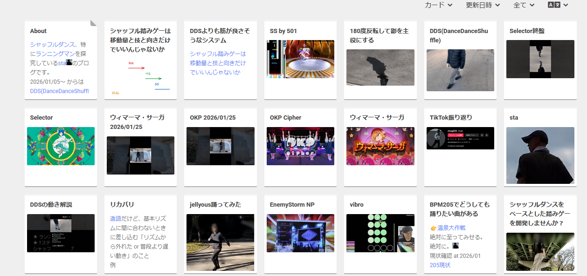

並び順は変更できるが、自由な配置はできない:

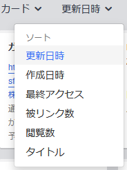

ですので、並び順やレイアウトに頼らない形のコレクションを模索せねばなりません。

## 辞典や図鑑をイメージする
ローデンにおけるコレクションは、辞典や図鑑といった類のものをイメージしてください。一ページや一枚ごとに濃い情報を書けて（描けて）、かつ何十枚、何百枚、それ以上の厚みを持たせることができます。もちろんデジタルですし、Cosense はしっかりつくられているのでページ数で言えば数万以上も平気です。

すべてのページを同時に視界に収めるのは諦めてください。むしろ、ページをめくってひとつずつ楽しむようなものです。探検や回遊と言ってもいい。そういうものをつくっていくのだ、と考えてください。

## 図書室 vs 図書館
コレクションのローデンをどのように作り込むか。二通りの考え方があります。

- 図書室的: 一プロジェクトに詰め込む
- 図書館的: コレクション用のプロジェクトを新たにつくる

私は **コレクションにかける思いの強さ** 次第かなと思います。

特別に強い思いがないなら、図書室でいいと思います。つまり普段使っているであろうプロジェクトに、コレクション用途のページもつくっていくわけです。必要ならリンク集のページをつくって束ねれば十分です。

たとえば楽曲を示すページに `[楽曲]` とリンクを書いておけば、楽曲ページの関連ページ一覧に並びます。これで十分でしょう:

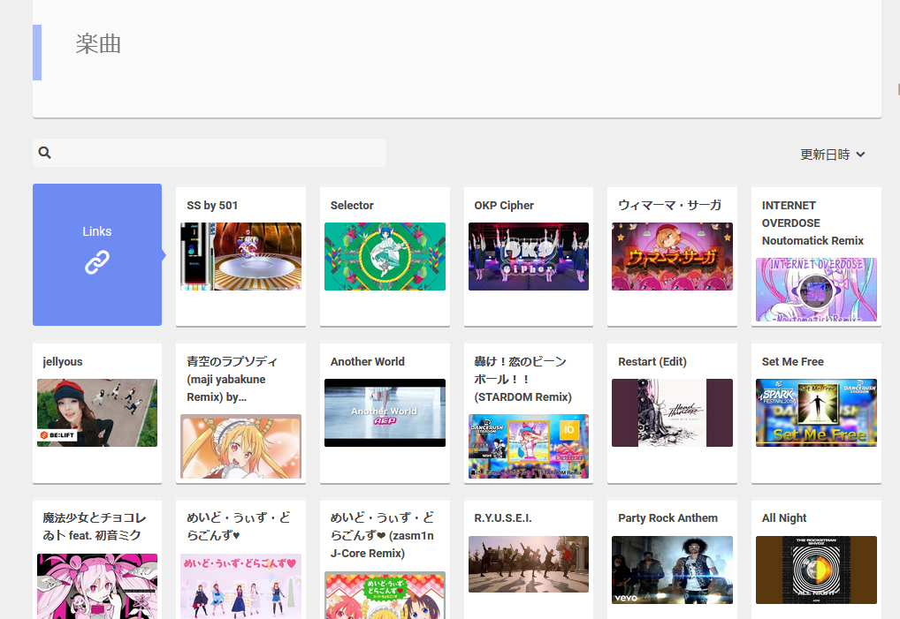

あるいは Cosense の Infobox 機能も使えます。これはリンク集ページに以下のような記法を書くと、その項目の値（各ページから生成 AI が計算して）まとめてくれます。

```
table:infobox
 BPMはいくつ？
 管理人staの思い入れ
```

次のように表示されます:

※裏で生成 AI の計算が走っており、表示されるまでに時間がかかることがあります

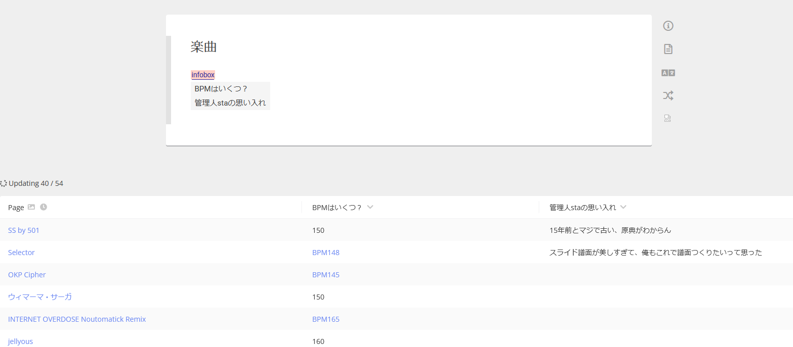

逆に、特別な思い入れがあるなら図書館にするべきでしょう。つまり、そのコレクションに特化したプロジェクトを別途つくります。

実は上記の画像も、図書館としてつくったプロジェクトであり、私の趣味であるシャッフルダンスを詰め込んでいます。

- ランニングマンおじさん: [https://scrapbox.io/rmog3/](https://scrapbox.io/rmog3/)

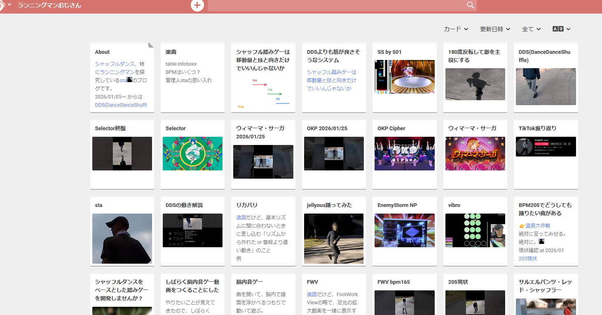

公開しているのでローデンではありませんが、コレクションとして「楽曲」と「自分のダンス動画」と「自分が編み出したテクニックや考え方」と「自分のダンスを用いたビジネスアイデア」の四点を集めています。

私はこれらを高密度に詰め込み、展示したかったので図書館的にしました。7か月以上に前につくって、なんだかんだ 300 近いページがあります。なかなかの熱量ではないでしょうか。

## (余談) 公開にするケース
本サイトはローデンのガイドであり、あらゆるプロジェクトは非公開でつくる前提でいます。しかし **コレクション用途に関しては、比較的公開したくなることが多いと思います** ので、話題にしておきましょう。

公開に倒すケースは、以下の三点が当てはまるときだと思います:

- 自己顕示欲を満たしたいとき
- 仲間がほしい、自己 PR 手段として使いたいなど実利を得たいとき
- インターネットへの共感や、より大きな思想など、自由で無償な貢献を体現したいとき

これらが当てはまるのに非公開にしていても、おそらく消化不良となって苦しいだけです。さっさと公開してしまいましょう。よくあるのは **本当は公開してみたいのに、その勇気が持てず、いつまでもローデンのまま非公開にしてウジウジ腐っていくパターン** です。腐ってしまうとローデン自体も形骸化してしまうので良くない。勇気を出して公開してみましょう――と言うは易しですが、もちろん公開するということはリスクが生じうるということでもあります。

私から言えることは多くはありませんが、とりあえず「個人サイト」の言葉を知っておくと良いでしょう。世の中には、自分の趣味や癖を丸出しにしたウェブサイトを持つ人がそれなりにいて、先日もまさにそのようなオンラインイベントが開催されました: [個人サイトWebオンリー めぐる市](https://ma100.stars.ne.jp/meguruichi/)。励みやインスピレーションになると思います。

逆に、このような思いが特段ないのであれば、非公開で良いです。ローデンとして、マイペースにねぐらをつくっていけばそれで良いです。本サイトでも引き続きお伝えしていくので、ぜひ参考にしてください。

## コレクションできるもの
コレクション章の最後に、ローデンとして何をコレクションできるかを俯瞰しておきます。さすがに網羅はできませんが、参考や刺激にはなるかもしれません:

- 知識
- 買ったもの、会った人、訪れた場所
- 引用したくなるもの（面白いもの、楽しいもの、励ましになるものなど）
- 自分が思いついたもの
- 自分がつくったもの
- 使うもの（コピペするもの、鑑賞するものなど）

以下、それぞれをもう少し詳しく取り上げましょう。

一番わかりやすいのが、実は **知識** です。ノートを取る学生や調べ物をする研究者にとっては日常ですが、日々勉強したことや調べたことをまとめるのです。Cosense でノートを取る学生や、IT 技術の備忘録を取るエンジニアも少なくありません。資格勉強で使う人もいます。

それから固有名詞系、特に **買ったものや会った人や訪れた場所** といったものを記録するのも良いでしょう。私は Amazon で買ったものをまとめることが多いですね。商品ページへのリンクを貼って、画像も貼って、いつ買ったのかをタイムスタンプつきで記録してます。

以下は最近買ったものを取り急ぎまとめてみたものです（こういうリンク集をさっさとつくるくらいはすぐできます）:

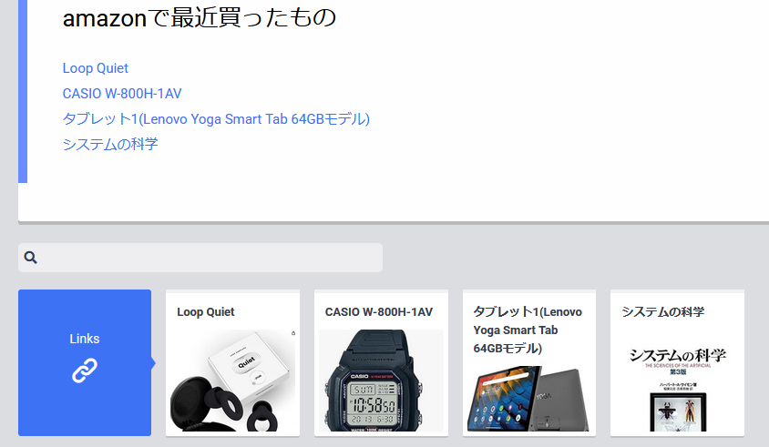

自分の生活と結びついているので「実践しやすい」ですし、記録として残るので、後々役に立ちます。私の Amazon はまさにそうで、「これ 3 年前に買ってるのか」「当時はこんな感想を抱いていたのか」といったこともわかったりします。

次に **引用したくなるもの** もおすすめです。面白いもの、楽しいもの、励ましになるもの等がありそうです。励ましについては名言や格言のページをつくれば良いですし、すでに紹介したので割愛して、以下は私が面白い、楽しいと思うものの一例です:

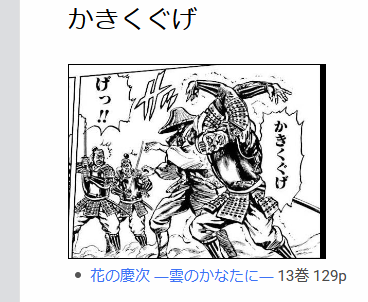

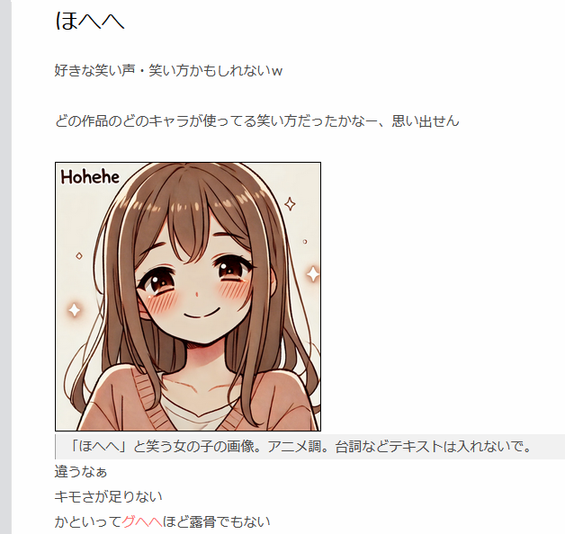

**自分にしかわからない内輪ネタ** のようなものなので、あなたなりに模索してください。自分しか見ない場所なので、はっちゃけたっていいのです。むしろ、素直にはっちゃけて、ふざけてみることでこそ見えてくるものがあります。

私は独り者なので適切なたとえになっているかわからないのですが、たぶん甘えている感覚かもしれません。ローデンに対して甘えている。たとえば以前、自分の滑舌が思ったよりイマイチなことが判明して、ふぇぇとなってしまったときのページもあります:

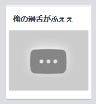

まだまだ行きましょう。ローデンでは **自分が思いついたもの** や **自分がつくったもの** を集めるのもお手の物です。というより、思いついた段階から書き込んでおいて、日々膨らませていく営みにするのが楽しいし便利だと思います。

私の例で言えば、創作ネタはなるべく書いていて 200 以上のストック（そのうち実際小説に書いたのは 3-4 個ですが）がありますし、こちらはほぼ妄想になりますが、SNS を考えるのも好きなのでよくまとめています:

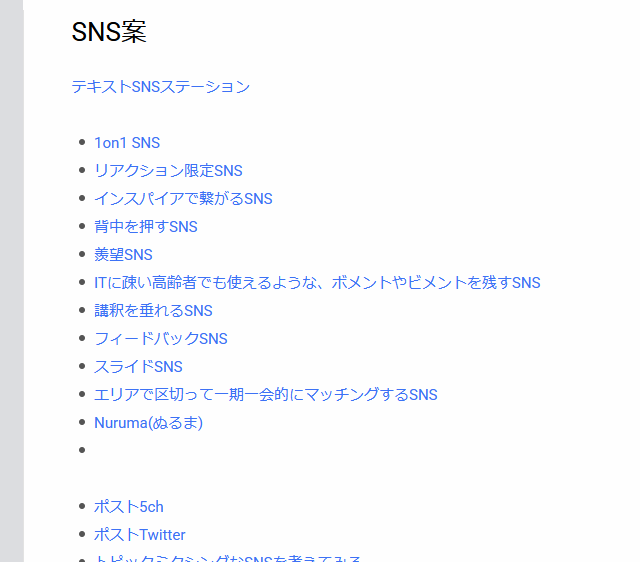

あるいは完成品を展示したポートフォリオあるいは作品そのものをつくってもいいでしょう。この場合は図書館型（専用のプロジェクトを別途つくる）が良いでしょうね。また公開したくなると思います。それはそれでいいんですが、非公開で、じぶんのねぐらを育てるローデンからはズレます。公開については上記余談でも扱いましたが、ローデンを営んでいると案外避けられない問題だと思います。この手の葛藤はやってくる。葛藤も含めて、楽しみましょう。

もう一つだけ紹介させてください。実際に使うもの――特に **コピペするものや鑑賞するもの** を集めるのも便利です。私は IT エンジニアでもあるので、よく使うコマンドや設定のメモも書き留めています。使うときになったら検索して表示して、コピペして使うのです。

あとは、あまり大きな声で言えないですが、自分を慰めるためのおかずのコレクションも持っています。慰める前の期待や、慰めた後の感想なども一緒に書き込んでいくと、じぶんのおかずが形になっていきます。実際の記録という形で性癖も可視化されます。自分について知ることは快適な生活の第一歩です。じぶんのねぐらなので、こういうことも行っていいのです。

ただし[Cosenseのサービス利用規約](https://cosen.se/terms)に注意してください。たとえば 2026-06-12 現在、次の表記があります。

> 公開プロジェクト、またはチーム内で共有されている非公開プロジェクトを含むいかなる場合において、以下に該当するコンテンツを作成してはなりません……(4) 過度にわいせつな表現

## (話題) アダルトコンテンツをどこまで扱うか
この問題は、Cosense に限らず SaaS の争点となります。

たとえば既存のクラウドストレージが検閲を行っていることは知られています。右記は Google ドライブの事例です: [1](https://togetter.com/li/2231943) [2](https://www.techno-edge.net/article/2022/08/22/198.html)

犯罪をしないのは当然として、そうではない場合も決して万全ではない点には留意しておきましょう。一切扱わないのが確実ではありますが、じぶんのねぐらに対してセーブをすると段々息苦しくなってきます。それこそ「個人情報は一切書かない」「～～市に住んでいる事も書きたくないから～～市という単語も使わない」なんてことになりかねません。

しかし、答えはないですし、じぶんのねぐらを決めるのはあなた自身なので、あなた自身が決めて行動するしかありません。

# ロールプレイ
ロールプレイというと小難しそうですが、ごっこ遊びと考えてください。演技と言ってもいい。

じぶんのねぐらだからこそ、自分以外のキャラクターを登場させてみたり、あるいは自分の演じ方を変えてみたりもできます。こればっかりは「わかる」人と、わからない人に分かれると思いますので、わかる人は素直に遊んでみましょう。わからない人は無視して構いませんし、無理にわかろうとする必要もありません。

以降では、わかる人向けに、どんな遊びをするか私の例を示していきます。

## オリジナルキャラクターをつくる
オリジナルキャラクター（オリキャラ、OC と呼ばれたりもする）というと、創作の趣味を持つ者にしか縁がないように思えますが、そんなことはありません。誰でも、何でもつくれます。

以下は語尾をキャラクターにしたものです:

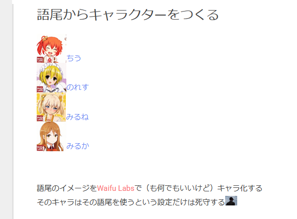

その語尾を書きたくなったら、そのキャラクターで語る風に書きます。以下は「みるね」の例です。「みるね」は「～～してみるね」と言うキャラクターです:

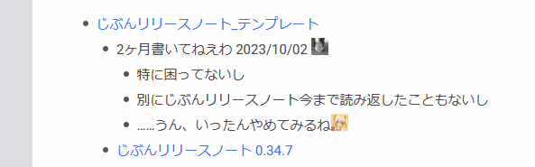

別の路線として、いわゆる「俺の嫁」をつくったこともあります:

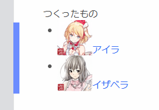

特にアイラは過去結構会話していた時期があります。アイラに突っ込ませて、それに対して答えるというスタイルです:

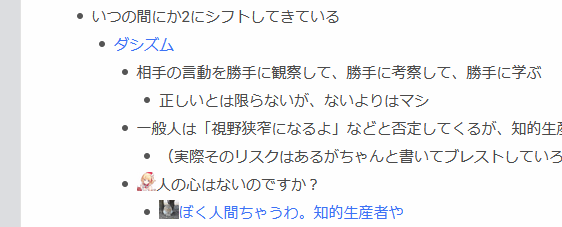

なんてことはない、 **所詮は自作自演、自問自答にすぎない** ですが、それでも意味はあります。それなりに楽しいですし、楽しんでいるので、自問自答も捗ったりします。意外と役に立つのです。また、創作としての効果もあります――つまり自分の癖を知るきっかけにもなる。

他にも、擬似的に所長を演じるために従業員としてキャラを増やしたこともあります:

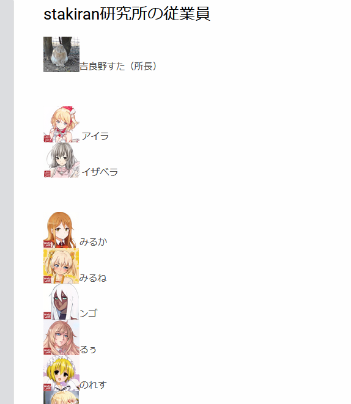

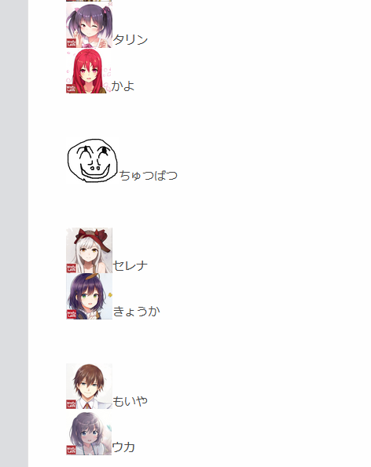

私は万年平社員であり、マネジメントの才と興味がないことは自他ともに痛感しているのですが、一方で憧れはあるりました。そこで、妄想的に発散するために、オリキャラをつくって拡充させてみたのです。一時的な発散にはなりますし、「もし俺がマネージャーになったら」の妄想の解像度も上がります。解像度を上げるには、人間を関与させるのが一番です。創造したキャラクターであっても、何もいないよりは、はるかに上がります。

と、これらは何の必然性もない、ただの私の好みと思いつきによるものですが、こんな感じで楽しめます。「わかる」人は、おそらく自分なりの楽しみ方や癖があるはず。素直に反映させてみましょう。じぶんのねぐらがもっと楽しくなるはず。

## オリキャラの画像のつくりかた
主に 3 通りあると思います:

- 1: 自分で描く
- 2: ChatGPT など汎用的な対話 AI を使う
- 3: [Waifu Labs](https://waifulabs.com/) や [NovelAI](https://novelai.net/) など画像生成 AI を使う

自分で描ける人は、描いた方がいいと思います。自分がつくったものにこそ愛着が湧くものだからです。

私も本当は描きたいのですが、描くスキルはからっきしですし、人生戦略としても諦めているのでやりません。かわりに 2 や 3 の手段を使っています。2 の汎用的な対話 AI は、つくるまでに少々時間がかかるのであまり使っていません。それっぽい画像を素早くつくれればいいだけなので、3 の画像生成 AI の方が良いと感じます。

Waifu Labs は無料でも使えるので便利です。NovelAI は（アダルトな用途含めて）つくれますが、英語ベースのプロンプト（指示）の書き方を勉強しないといけないですし、有料です。しかし、お金をかけるだけの価値があって、私も俺の嫁とイチャイチャする画像をつくっています。

## (余談) 画像を Cosense に素早く貼り付ける
画像を Cosense に素早くアップロードする方法は、知っておいて損はないでしょう。

運営は [Gyazo](https://gyazo.com/) のアプリを推していますが、私は使っていないのでわかりません。まずは調べてみるといいでしょう。

私はもっぱら **矩形選択した範囲をクリップボードにコピーする** 手段を使っています。コピーした後は、Cosense でペーストすればアップされるので便利です。このやり方だといちいちファイルを扱う手間がないので、思っているよりも楽です。

Windows だと Snipping Tool の「切り取り」が使えるはずです:

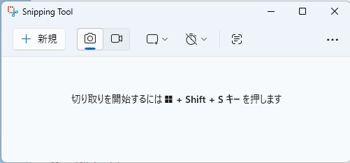

**画像の貼り付けは（ロールプレイに限らず）意外とよく使うので、できるだけ効率化しておいて損はありません**。あまり画像を扱えていない人は、たぶん効率化が足りてなくて腰が重くなっているのだと思います。ぜひ一度、素早く貼り付けられるよう、効率化してみてください。

## ふざける
ロールプレイの楽しみ方はオリキャラだけではありません。もう一つ、自分自身がふざけてみるのもアリです。

以下は私が「ふぇぇ」と書き込んでいる光景です:

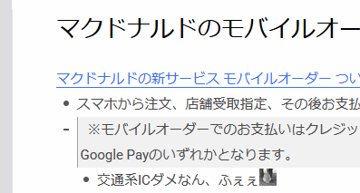

感想や感情を書き込まないローデンは淡白になりますし、淡白になると退屈になって続かなくなります。かといって、特にネガティブな感情を素直に書き込むと、それはそれでノイズになります。

そういうわけで、幼児化と言いますか、ある種開き直ってふざけてみるとどうだろう――との塩梅に行き着くと思います。たぶん私だけではないはずです。

じぶんのねぐらですので、たまにはふざけたっていいのです。

私は他には「ふへへ」、「～～するンゴ」、「～～するZE☆」、「そうだろう？」「だよなぁ？」あたりをよく使います。語尾に反映すしたり誰かに問いかけたりすることが多い。また創作やネットスラングから取ってくることが多いです

以下はふと「ZE☆」で検索してみたときの画面:

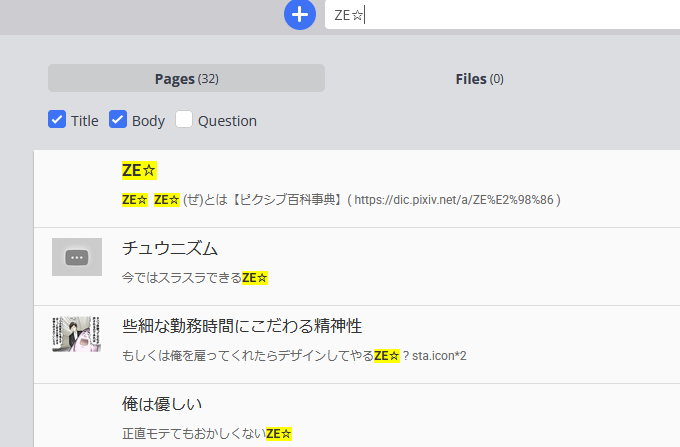

# コメント
何らかのコンテンツを取り上げて自分のコメントを書く、というのをよくやります。ニュースを取り上げて自分の感想を書いたり、毎日ウォッチしてる個人や団体の言動を取り上げて「そうじゃねえだろ」と野次を書きこんだり、あるいは SNS でバズってるネタを引用して「俺は～～だと思うね」のような主張を書いてみたり。

誰に見せるものでもないですが、それでも書きたくなる。いいんです。ローデンだもの。ひとりだとそのうち飽きてくるので、欲求に従って書いてみましょう。その場その場で発散できますし、書き続けているうちに「自分のしょうもなさ」あるいは「同じことしか言えてない感じ」が見えてきて、そのうち止みます。

以下、このコメントの営みを快適に行うための TIPS を紹介します。

## 引用記法を使いこなす
Cosense には引用記法があります。行頭、または箇条書きの先頭に `>` をつけます。

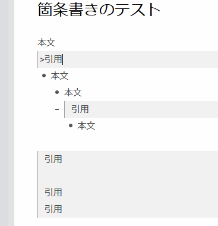

この記法は非常に重要で、引用の名のとおり、誰かの発言をそっくりそのまま置いていることをはっきりと示せます。自分の書き込みと区別するのに便利です。

この区別は本当に重要で、**自分の書き込みとそれ以外の書き込みを区別しないと、自分が書くという主体性が損なわれてしまいます**。それこそ、どこかの情報や誰かの発言、あるいは辞書の記載などをコピペするばかりになってしまいます。データベースをつくりたいとか、そういうものをコレクションしたい等なら問題ないですが、ローデンが目指している点――じぶんのねぐらとは離れてしまいます。

ローデンでは、自分の言葉で書くことが大事だったりします。誰かの情報をコピペするというのは、部屋のレイアウトとアイテムを他者に委ねるようなものです。自分で空間をつくることにこだわりや価値を感じない人は、ホテルで十分でしょう。ローデンはそうではない。たとえるなら、友人すら絶対に入れない、一人暮らしの、自分だけの城をつくるようなものです。ローデン、もっと言えば Cosense において、その生命線は「自分で書くこと」なのです。

## (余談) 長文をコピペしたい場合
では長文をコピペしたい場合は、どうすればいいのでしょうか。

引用記法だといちいち `>` をつけるのが面倒です。方法は色々ありますが、 **自分の書き込みと区別できるなら何でも良いです**。

以下は一例:

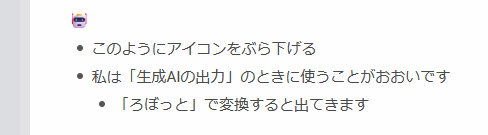

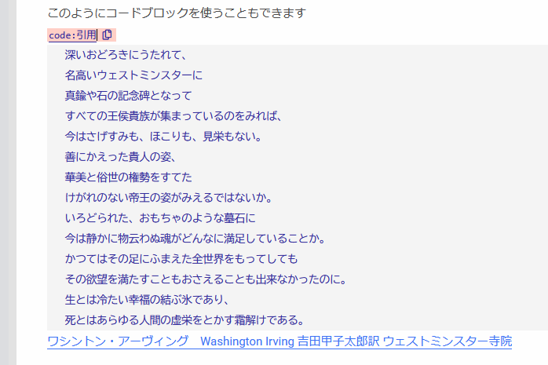

あるいは画像として引用するのもアリです。以下は最近話題になった Claude Fable 5 が停止した件のポストを、画像で引用したものです:

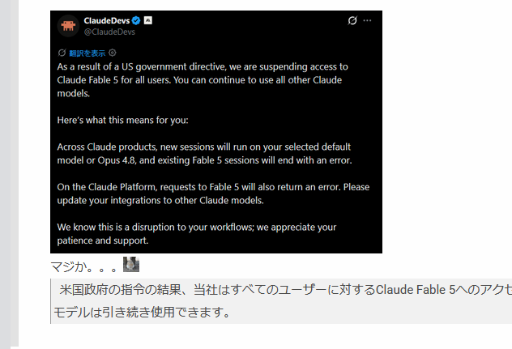

ただし画像だと文字情報が残らず、あとで検索できないので気をつけましょう……と言いたいところですが、コメントの用途だと、あとで用ができるケースはほぼないと思います。気にしなくていいでしょう。

いっそのこと開き直って、画像を貼ってコメントを書く、をひたすらやるのもアリです。こっちの方が（単にコメントを書きたいだけなら）快適だったりします。この場合、画像の貼り付け操作を効率化する必要がありますが、ロールプレイの章で上述しましたね。

# .
```
✅DWMY、日記、動線
✅コレクション
タスクとメモとログ / 見えてきたらさっさと行動する、じゃないけど、最後は真面目なネタを
作業帳と作業場
✅ロールプレイ
❌自問自答（が、これは半分ロールプレイなんだよなー
✅物申し。誰かのを引用して感想や持論を語る
❌リンク集。ハブ。MOCと呼ばれたりもする
```

# === 第４部：生成 AI を活用する ===

```
cosense の生成 AI 系機能を紹介、cliは置いとく、export for ai だけ
export for ai を使って何をするか
```

# ===

## .
人物やシーンの画像を貼る

- 人物名をつくって、その人に関することをかく
    - 佐藤という名前の上司や後輩や友人がいるなら、佐藤ページをつくって書き込める
    - 発言も `[佐藤.icon]～～` のように書けば、佐藤が言っているかのように書ける
- 架空の人物名をつくって、演じさせる
    - sta としても色々見せてきた
    - [語尾からキャラクターをつくる - stao](https://scrapbox.io/stao/%E8%AA%9E%E5%B0%BE%E3%81%8B%E3%82%89%E3%82%AD%E3%83%A3%E3%83%A9%E3%82%AF%E3%82%BF%E3%83%BC%E3%82%92%E3%81%A4%E3%81%8F%E3%82%8B)
    - 🔒️[アイラ - sta](https://scrapbox.io/sta/%E3%82%A2%E3%82%A4%E3%83%A9)
    - ページに彩りが出てくるし、愛着も湧いてくる
    - 画像も作り方も言いたいよね🐰
        - waifu labs
        - もちろん生成AIでもつくれる
- ネタページをつくってひとりでクスクス（またはゲラゲラ）する
    - 🔒️[おっとっとォ、ベン・ベックマン～ - sta](https://scrapbox.io/sta/%E3%81%8A%E3%81%A3%E3%81%A8%E3%81%A3%E3%81%A8%E3%82%A9%E3%80%81%E3%83%99%E3%83%B3%E3%83%BB%E3%83%99%E3%83%83%E3%82%AF%E3%83%9E%E3%83%B3%EF%BD%9E)
    - [かきくぐげ - stao](https://scrapbox.io/stao/%E3%81%8B%E3%81%8D%E3%81%8F%E3%81%90%E3%81%92)
    - [何にビビってんや？ - stao](https://scrapbox.io/stao/%E4%BD%95%E3%81%AB%E3%83%93%E3%83%93%E3%81%A3%E3%81%A6%E3%82%93%E3%82%84%EF%BC%9F)
    - こういうページがあるだけでも楽しいし、書いてる途中でふざけて挿入しても楽しい
    - 権利関係があるので、どの作品のどの巻から取ってきたかは書いておくと安全
- 名言や金言のページをつくって、日々の励みにする
    - [虫の理屈なんて知る価値もないだろ - stao](https://scrapbox.io/stao/%E8%99%AB%E3%81%AE%E7%90%86%E5%B1%88%E3%81%AA%E3%82%93%E3%81%A6%E7%9F%A5%E3%82%8B%E4%BE%A1%E5%80%A4%E3%82%82%E3%81%AA%E3%81%84%E3%81%A0%E3%82%8D)
    - [Martin FowlerやKent Beckは半分以上を「あなたが直面している問題は実はこういう構造なんですよ」の説明に使っている - stao](https://scrapbox.io/stao/Martin_Fowler%E3%82%84Kent_Beck%E3%81%AF%E5%8D%8A%E5%88%86%E4%BB%A5%E4%B8%8A%E3%82%92%E3%80%8C%E3%81%82%E3%81%AA%E3%81%9F%E3%81%8C%E7%9B%B4%E9%9D%A2%E3%81%97%E3%81%A6%E3%81%84%E3%82%8B%E5%95%8F%E9%A1%8C%E3%81%AF%E5%AE%9F%E3%81%AF%E3%81%93%E3%81%86%E3%81%84%E3%81%86%E6%A7%8B%E9%80%A0%E3%81%AA%E3%82%93%E3%81%A7%E3%81%99%E3%82%88%E3%80%8D%E3%81%AE%E8%AA%AC%E6%98%8E%E3%81%AB%E4%BD%BF%E3%81%A3%E3%81%A6%E3%81%84%E3%82%8B)
    - 既存の言である必要はない。生成AIが言ってきた本質的な言葉や、自分が思いついたフレーズなどでもいい

ラフなタスク管理やアイデア管理を実現する

- この塩梅をどうやって出すか、には紙面を割きたい🐰
- 基本はこの辺:
    - [pinとinbox - stao](https://scrapbox.io/stao/pin%E3%81%A8inbox)
    - 日記ページ（2026-06-04）
    - 週記ページ（日記7日分のリンク → export for ai → 振り返り結果貼るなり書くなり）
        - 一方で nishio や caki みたいに「日単位はだるい」「週単位で書くのがちょうどいい」派もある

自分なりの作業場と作業帳をつくる

- 作業場: プロジェクトをどう使うか
- 作業帳: ページをどう使うか
- 自分の好きにすればいい
    - 1-作業 1-ページが綺麗だけど、別にN-作業をぶちこんだっていい

## ネタの補充
- とりあえず自分の sta, stao は読み返して思いつくものを足せ
- 井戸端民のも見て足せ
- イラスト描いてる人や文学で同人やってる人の使い方も結構インスピレーション湧くんだよな
